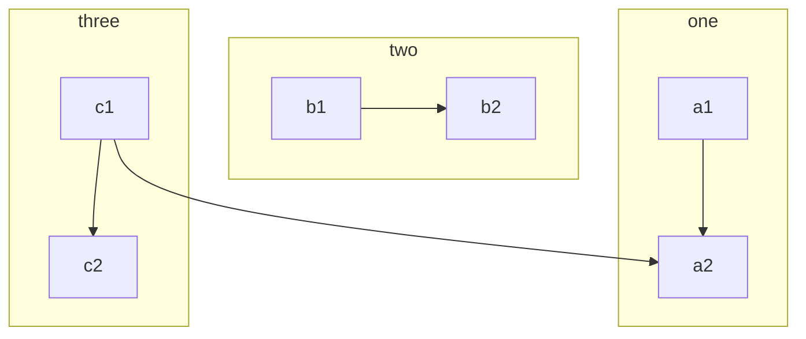

Math latex test
This is an inline math example: 

$$
\int_{a}^{b} f(x)\,dx = F(b) - F(a)
$$

$$
Y = mX + b
$$

```mermaid
  graph TD;
      A-->B;
      A-->C;
      B-->D;
      C-->D;
```

```mermaid
graph TB
    c1-->a2
    subgraph one
    a1-->a2
    end
    subgraph two
    b1-->b2
    end
    subgraph three
    c1-->c2
    end
```
