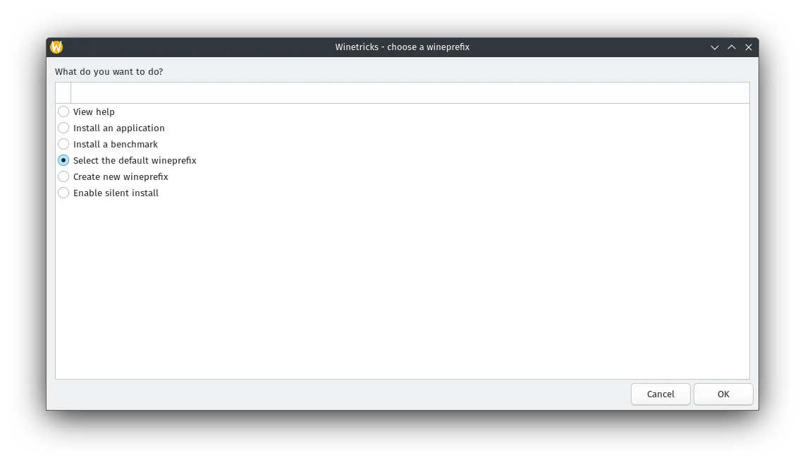
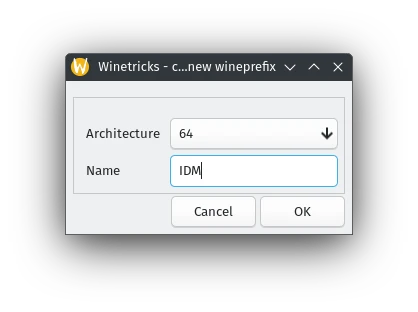
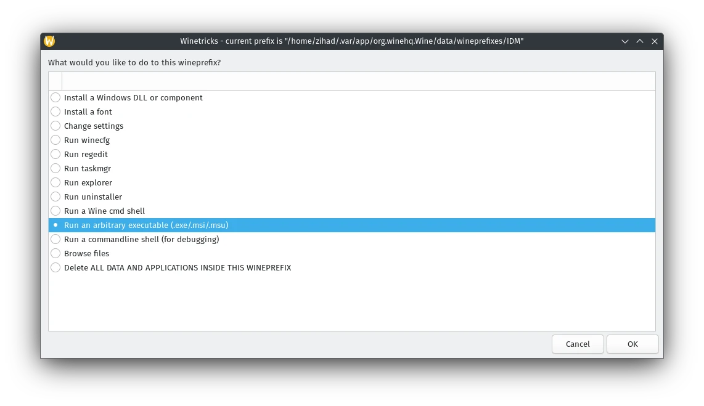
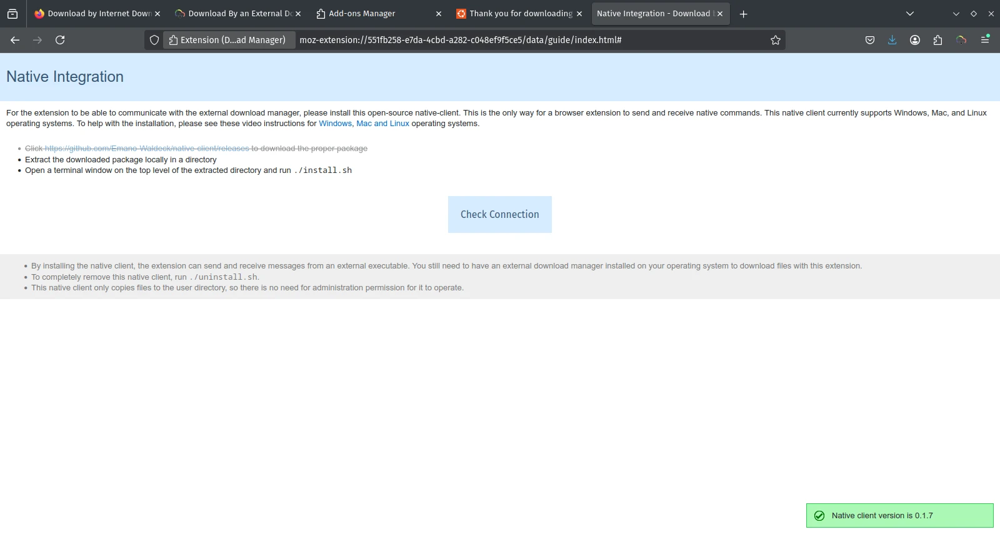
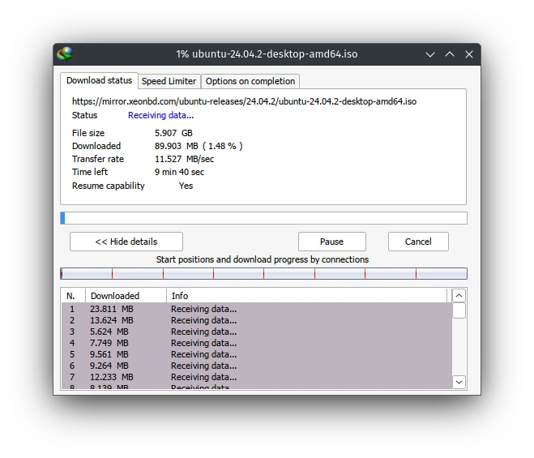

Prerequisite: [Flatpak](https://flatpak.org/setup/).  
## Introduction  
If you're a long-time Windows user who recently switched to Linux, chances are you've missed a few familiar tools—especially Internet Download Manager (IDM). Known for its blazing fast downloads, browser integration, and ability to resume interrupted files, IDM is a favorite among users who frequently download large files or media.

But here's the catch: IDM was built for Windows. There's no official Linux version.

So the question is—how do you get IDM-like functionality on Linux, complete with extension support for Chrome or Firefox? That’s exactly what we’re going to solve in this guide. Let’s get you back to downloading like a boss, the Linux way.

## Install IDM through WINE

1. Install WINE using Flatpak.  
```sh
flatpak install flathub org.winehq.Wine//stable
```

2. Create a 64-Bit WINEPREFIX named `IDM` using flatpak winetricks. Install IDM in default location.  
```sh
flatpak run --command=winetricks org.winehq.Wine
```

3. Open Winetricks


4. Select Winetricks Prefix **Architecture:** `64`, **Name:** `IDM`  


5. Run **IDM** exe installer


6. put this script as `idm` in `~/.local/bin/`.  
Make it **executable**. 
```sh
chmod +x ~/.local/bin/idm
```  

> Change USER_NAME.
{: .prompt-warning }

```bash
#!/bin/bash

if  [[ $1 == '-d' ]]; then
   flatpak run --env="WINEPREFIX=/home/USER_NAME/.var/app/org.winehq.Wine/data/wineprefixes/IDM/" org.winehq.Wine "/home/USER_NAME/.var/app/org.winehq.Wine/data/wineprefixes/IDM/drive_c/Program Files (x86)/Internet Download Manager/IDMan.exe" /d "$2"
elif [[ $1 == *://* ]]; then
  flatpak run --env="WINEPREFIX=/home/USER_NAME/.var/app/org.winehq.Wine/data/wineprefixes/IDM/" org.winehq.Wine "/home/USER_NAME/.var/app/org.winehq.Wine/data/wineprefixes/IDM/drive_c/Program Files (x86)/Internet Download Manager/IDMan.exe" /d "$1"
else
  echo "Usage: idm [URL] or idm -d [URL]"
fi
```
7. Put `idm.png` icon in `~/.local/share/icons`. Or directly link idm icon.   
[idm.png source](https://github.com/tazihad/idm-linux/blob/65430a627053d5be3b092b8a7688b96c16af3245/idm.png)

8. Create application launcher in

`~/.local/share/applications/idm.desktop`  
```
[Desktop Entry]
Name=Internet Download Manager
Exec=flatpak run --env="WINEPREFIX=/home/USER_NAME/.var/app/org.winehq.Wine/data/wineprefixes/IDM/" org.winehq.Wine "/home/USER_NAME/.var/app/org.winehq.Wine/data/wineprefixes/IDM/drive_c/Program Files (x86)/Internet Download Manager/IDMan.exe" @@u %U @@
Type=Application
Terminal=false
Categories=Internet;
Icon=/home/USER_NAME/.var/app/org.winehq.Wine/data/icons/hicolor/48x48/apps/2829_IDMan.0.png
Comment=Launch Internet Download Manager.
StartupWMClass=Internet Download Manager
```  

> Change USER_NAME.
{: .prompt-warning }


### Extension

#### Firefox based browsers

1. Install extension: [Download by Internet Download Manager](https://addons.mozilla.org/en-US/firefox/addon/download-by-idm/)  
2. Turn on the Extension by clicking it. Try Download something. It will prompt you to **install Native Messaging**. Install it.  
[Native Messaging source](https://github.com/Emano-Waldeck/native-client/releases/tag/0.1.5).  
3. Enable and pin extension:

4. Install native messaging: Check connection should give you green signal

5. Restart browser. Test a download.


#### Chromium based browsers

Unfortunately Google has remove the extension from webstore because of Manifest V2.

