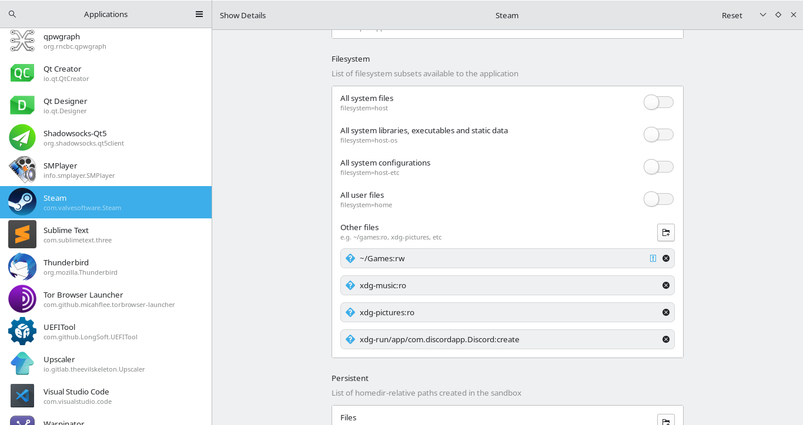
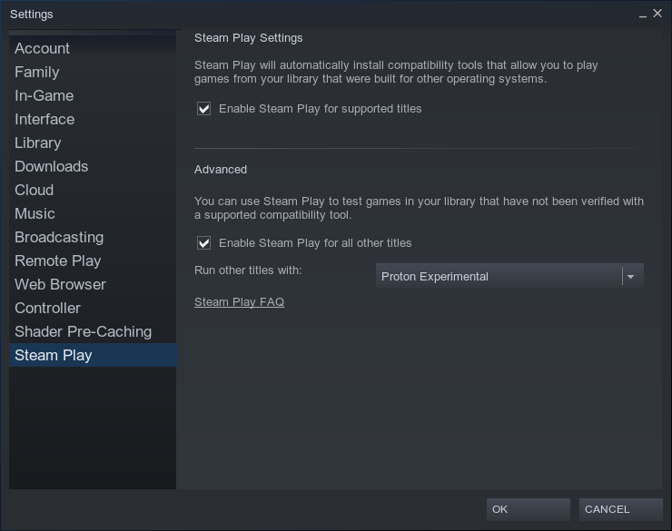
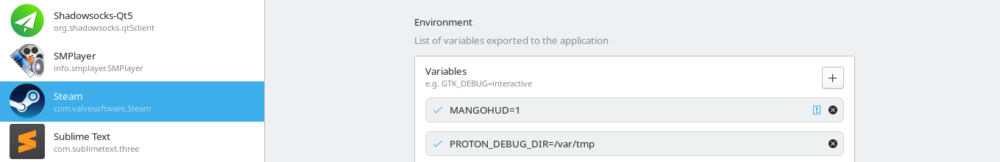
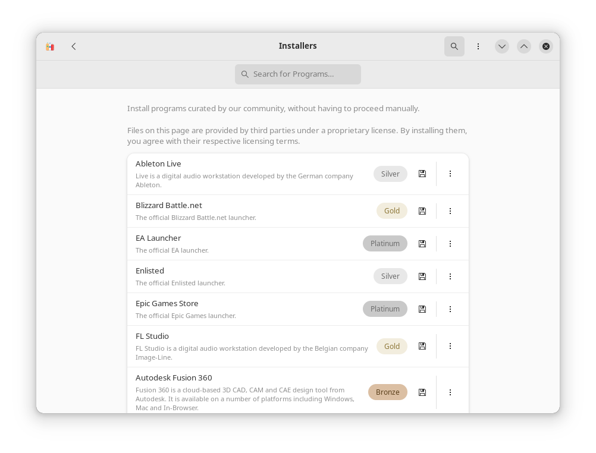
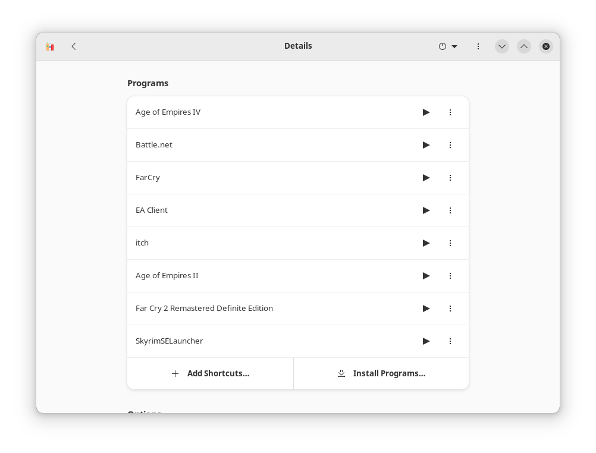
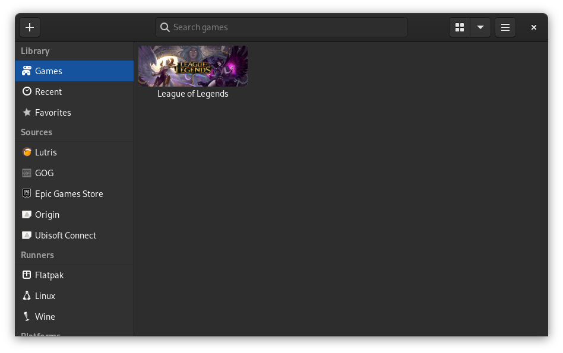

This guide should be applicable for both Fedora Silverblue and Fedora Kinoite.  
I am using Fedora Kinoite 37.  And Wayland as display server.  And Pipewire as audio. Wayland, Pipewire comes pre-installed in both Silverblue and Kinoite.  

There are mainly 3 approaches for gaming in Silverblue.  
1. Flatpak (recommanded).
2. Layering softwares with `rpm-ostree`.
3. Installing inside toolbox/distrobox.

To start with Gaming. If you are NVIDIA user. Make sure you have installed NVIDIA drivers.  
To check if you have nvidia driver installed.  Try `nvidia-smi` from terminal.  
If you haven't installed NVIDIA driver. Check out our [other guide](https://zihad.com.bd/posts/top-10-things-to-do-after-installing-fedora-silverblue-kinoite/) to Install NVIDIA Driver.

## Flatpak

We need some **prerequisites** for making this smooth.  
1. Make sure you have added `flathub` as remote.  
   ```bash
   flatpak remote-add --if-not-exists flathub https://flathub.org/repo/flathub.flatpakrepo
   ```
   
 2. Flatseal. To manager permissions.
    ```bash
    flatpak install flathub com.github.tchx84.Flatseal
    ```
    
 3. ProtonUp-Qt. This will help us manager proton.
    ```bash
    flatpak install flathub net.davidotek.pupgui2
    ```
 4. MangoHud. Game stats.  
    ```bash
    flatpak install org.freedesktop.Platform.VulkanLayer.MangoHud
    ```
 
 Now we are going to install **Steam**, Lutris, Heroic Games Launcher(**Epic & Gog Games**), Bottles.  
 
### Steam

Install.  
```bash
flatpak install flathub com.valvesoftware.Steam
```

Now use Flatseal to set permission to access folders or drive other than the default location.  Add location to `Other files`.  

  

Open Steam. From Settings enable `Enable Steam Play for supported titles`. And `Enable Steam Play for all other titles`. Use any version. from drop down. `Proton Experimental` is fine.  


To enable MangoHud for all Steam games. You can either set `MANGOHUD=1` in `Environment` with flatseal. Or from Command.   


command:  
```bash
flatpak override --user --env=MANGOHUD=1 com.valvesoftware.Steam
```

### Lutris

Install.
```bash
flatpak install flathub net.lutris.Lutris
```

Use flatseal to set permission for different location or drive.  

### Heroic Games Launcher

Heroic Games Launcher is open source client for Epic Games and GOG Games. Even though it's not official launcher. It does amazing job to play all of your Epic Games and GOG.  

Install:  
```bash
flatpak install flathub com.heroicgameslauncher.hgl
```

This is pretty straight forward. You login with your account and start playing. Try fiddling with settings.  

### Bottles

Bottles is amazing. I am going to show you how can you install install and play other launchers and start Playing games. Such as **Battle.net**, **EALauncher**, **itch.io** launcher.  

Now install Bottle.  
```bash
flatpak install flathub com.usebottles.bottles
```

We are going to give it permission to generate desktop entries.  
```bash
flatpak override com.usebottles.bottles --user --filesystem=xdg-data/applications
```

Now open Bottles. And create a gaming bottle. Name anything you want. I am using `wingames`.  

Below in the `Options` tab. Go to `Dependencies`. And install some recommended dependencies.  
- allfonts 
- winhttp
- d3dx11
- dotnet48
- vcredist2019
- mono
- gecko

From the `Installed Programs...` option. Install `Blizzard Battle.net`, `EA Launcher`, `Origin`, `Ubisoft`. Install the Launcher you want.  That's it. Enjoy playing.  


To install **itch.io** inside the bottle. Make sure you [install Windows version](https://itch.io/app/download?platform=windows) of the client.  

Now `Run Executable` from the bottle. And install itch.io. Exit before login.  

Add the itch shortcut if it's not auto added.  
`~/.var/app/com.usebottles.bottles/data/bottles/bottles/wingames/drive_c/users/zihad/AppData/Local/itch/itch-setup.exe`. Yes `itch-setup.exe` is the one you want.  

Now change the **launch option** from 3 dot menu.  
Put `Command Argument` as `--prefer-launch --appname itch`

Now run **itch** as usual. You can create Application Launcher shortcut of all of your launcher.  



### Waydroid / Android Games

Do you want to play Android Games? Even though much complex games may not work. But Basic mouse based android games works smooth. You will need **wayland** for it. Check out our other turorial of Wayland Installation.

## Gaming inside toolbox/distrobox.

In this section we will install League of Legends inside distrobox.  

### League of Legends in Silverblue  



First, lets create a distrobox environment named `gaming`. Use any you wish.  

```bash
distrobox create --name gaming --image registry.fedoraproject.org/fedora-toolbox:37 --home /home/zihad/.var/distrobox/home/gaming
```
> Make sure you create a seperate home directory for your `gaming` environment. And replace your username.  

```bash
distrobox enter gaming
```
Install NVIDIA driver inside container if you have one.  
```bash
sudo dnf install https://mirrors.rpmfusion.org/free/fedora/rpmfusion-free-release-$(rpm -E %fedora).noarch.rpm https://mirrors.rpmfusion.org/nonfree/fedora/rpmfusion-nonfree-release-$(rpm -E %fedora).noarch.rpm
```

```bash
sudo dnf update -y
sudo dnf install akmod-nvidia
```

You have to reboot system probably.  

Install Lutris:  
```bash
sudo dnf install lutris
```

export the lutris app to your hot.

```bash
distrobox-export --app lutris
```

Now use this lutris to install League of Legends as usual from Lutris.
