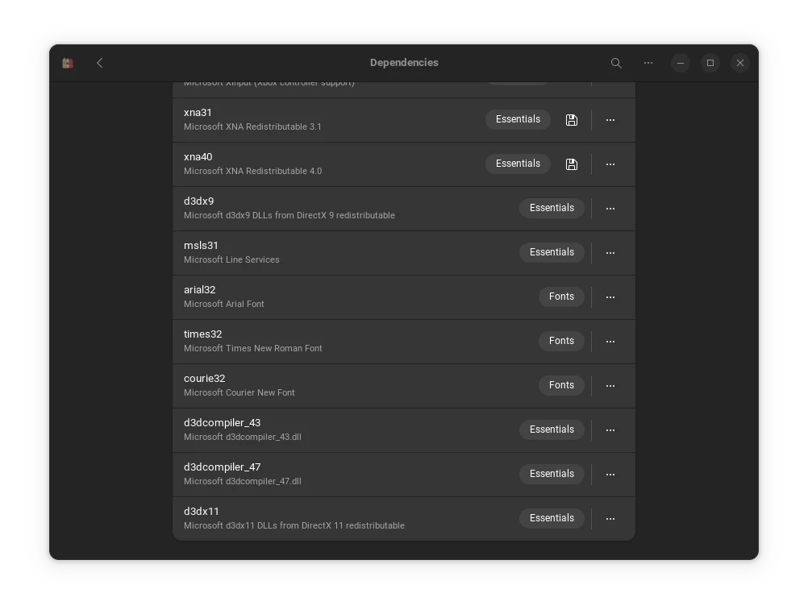

League of Legends can be played on linux in several ways. Lutris is one of them. But my favourite one is Bottles. Because I play all of my other games using Bottles. Bottles also has better UI than Lutris. It's my personal preference.  

Requirements:  
1. Flatpak 1.15.  
2. Bottles from [Flathub](https://flathub.org/apps/com.usebottles.bottles).  

Fedora 38 Silverblue and Kinoite both have upgraded to flatpak v1.15. If you are on steam deck, check which version of flatpak you are using from command line as `flatpak --version`.  

Let's follow the steps:

1. Download latest Runner from **Preferences**. Runners -> Lutris ->**Lutris-ge-lol-***.  


2. Create a new Bottle **league-of-legends** under **Gaming** environment.  


3. Open the created bottle **league-of-legends**. Go to **Settings**. Change **Runner** to latest  **Lutris-ge-lol-***.  


4. From **Dependencies** install `d3dx11`.  


5. Now Download official League client from official [site](https://lol.secure.dyn.riotcdn.net/channels/public/x/installer/current/live.na.exe).  

6. Click **Run Executable** from Bottles. Select downloaded league client. Install it.  


   Riot client will automatically start. Let it download its content. But don't log in. Exit the Riot Client. Make sure to close it from taskbar.

7. From bottles click **Add Shortcuts...**.   
And add `RiotClientServices.exe`.  
You can find it in  
    ```
    ~/.var/app/com.usebottles.bottles/data/bottles/bottles/league-of-legends/drive_c/Riot Games/Riot Client/RiotClientServices.exe
    ```
You can rename  the `RiotClientServices.exe` as `League of Legends`  


8. Click on the 3 ribbon of **League of Legends**. Select **Change launch option**. Make sure `DXVK` and VKD3D enabled. 


That should be it. Now run League of Legends. Log in. Complete the installation.  

You can now play League of Legends.  

If you don't want to open riotclient to open the League client make sure to add Launch option to following.But Make sure to add the argument after Complete installation of League of Legends. This will directly open League client.  

Add **Command Arguments** as the following:   
   ```
   DXVK_LOG_LEVEL=none STAGING_SHARED_MEMORY=1 WINE_LARGE_ADDRESS_AWARE=1 WINEDLLOVERRIDES="d3d10=n,d3d11=n" %command% --locale=en_GB --launch-product=league_of_legends --launch-patchline=live
   ```  
   
   

Now we can play the game.  


