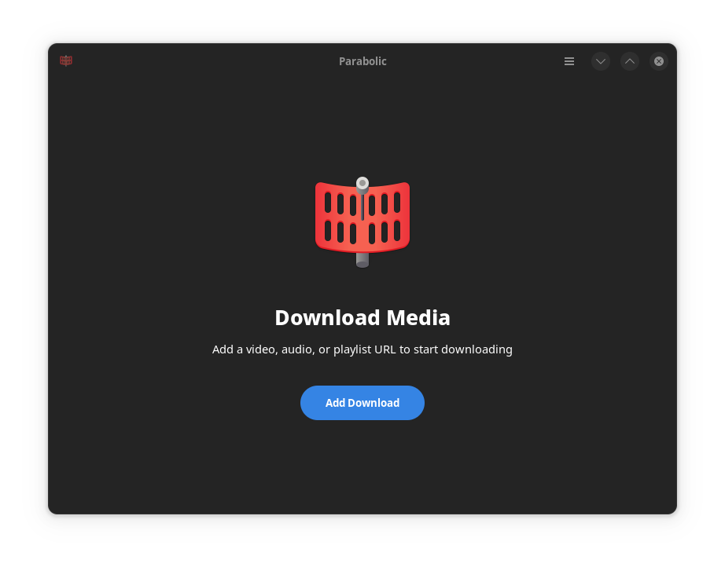

We are going to use Parabolic Youtube Downloader and integrate with firefox browser. Chromium doesn't have the extension support.




Prerequisite: `flatpak`

- Install Parabolic
```
flatpak install --user flathub org.nickvision.tubeconverter
```
- Install browser [Open With](https://addons.mozilla.org/en-US/firefox/addon/open-with/) extension for firefox. Open the action and setup the `open_with_linux.py`.  
Go to `Add browser`. And set up the following:  
**Name:** `Parabolic`  
**Command:** 
```
/usr/bin/flatpak run --branch=stable --arch=x86_64 --command=/app/bin/org.nickvision.tubeconverter org.nickvision.tubeconverter
```
**Custom Icons:** Browse for custom icon. If you installed app as user it should be in  
```
~/.local/share/flatpak/exports/share/icons/hicolor/scalable/apps/org.nickvision.tubeconverter.svg
```
Or if you installed as systemwide
```
/var/lib/flatpak/exports/share/icons/hicolor/scalable/apps/org.nickvision.tubeconverter.svg
```

That's it. Now go to youtube and open the webpage with parabolic. It will start downloads.