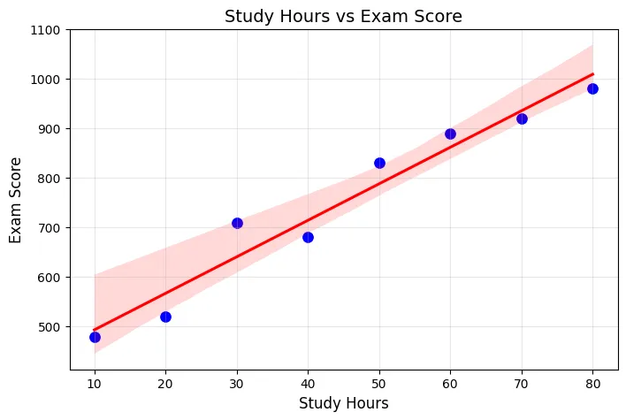
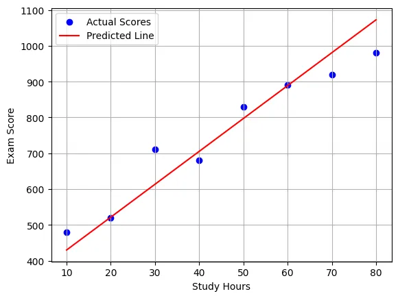
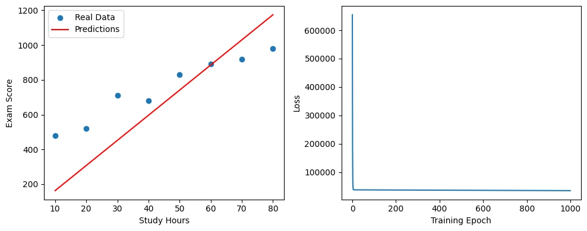

Now that we have made our hand dirty. We are going to learn some basics. 

# Linear Regression
Linear Regression is one of the most fundamental algorithm in Machine Learning.

Here's a simple dataset.

| Study Hours (X) | Exam Score (Y) |
|-----------------|----------------|
|       1         |       48       |
|       2         |       52       |
|       3         |       71       |
|       4         |       68       |
|       5         |       83       |
|       6         |       89       |
|       7         |       92       |
|       8         |       98       |

We can visualize this on our Jupyter Notebook.
Install dependencies:
```bash
conda install matplotlib seaborn
```
Run
```python
import matplotlib.pyplot as plt
import seaborn as sns

# Data
study_hours = [10, 20, 30, 40, 50, 60, 70, 80]
exam_scores = [480, 520, 710, 680, 830, 890, 920, 980]

# Create scatter plot
plt.figure(figsize=(8, 5))
sns.scatterplot(x=study_hours, y=exam_scores, s=100, color='blue')

# Add regression line
sns.regplot(x=study_hours, y=exam_scores, scatter=False, color='red')

# Customize plot
plt.title('Study Hours vs Exam Score', fontsize=14)
plt.xlabel('Study Hours', fontsize=12)
plt.ylabel('Exam Score', fontsize=12)
plt.grid(True, alpha=0.3)

plt.show()
```



As you can see, Sudy Hours vs Exam Score gives a straight line. With this line and data we can actually predict a score. We can only guess, a close guess. The more the hours the more the score.
How can we predict? 
```
Exam Score = (Slope × Study Hours) + Starting Score
```

How did we get this? Remember in high school we had an equatiopn for this.

$$
Y = mX + b
$$

Where 
- X (Independent Variable): Study Hours
- Y (Dependent Variable): Exam Score
- m = slope → How much Y increases per unit increase in X
- b = intercept → Expected Y value when X = 0

## Making any prediction
If X = 45 hours:
$$
Y=m×45+b≈751 
$$
(close to the actual score)

We can visualize the predicted line.
```python
import matplotlib.pyplot as plt

X = [10, 20, 30, 40, 50, 60, 70, 80]
Y = [480, 520, 710, 680, 830, 890, 920, 980]

plt.scatter(X, Y, color='blue', label='Actual Scores')
plt.plot(X, [9.18*x + 338.15 for x in X], 'r-', label='Predicted Line')
plt.xlabel('Study Hours'), plt.ylabel('Exam Score')
plt.legend(), plt.grid(True)
plt.show()
```


Now we can use PyTorch to implement linear regression. 
```python
import torch
import matplotlib.pyplot as plt

# 1. Prepare the data (convert to tensors)
study_hours = torch.tensor([10, 20, 30, 40, 50, 60, 70, 80], dtype=torch.float32)
exam_scores = torch.tensor([480, 520, 710, 680, 830, 890, 920, 980], dtype=torch.float32)

# 2. Create a simple linear model
model = torch.nn.Linear(1, 1)  # 1 input, 1 output

# 3. Choose loss function and optimizer
loss_fn = torch.nn.MSELoss()  # Mean Squared Error
optimizer = torch.optim.SGD(model.parameters(), lr=0.0001)  # Learning rate

# 4. Train the model
losses = []
for epoch in range(1000):
    # Reshape input to match model expectations
    inputs = study_hours.view(-1, 1)
    targets = exam_scores.view(-1, 1)
    
    # Forward pass
    predictions = model(inputs)
    loss = loss_fn(predictions, targets)
    
    # Backward pass
    optimizer.zero_grad()
    loss.backward()
    optimizer.step()
    
    # Store loss for plotting
    losses.append(loss.item())

# 5. Make predictions
with torch.no_grad():
    predicted_scores = model(study_hours.view(-1, 1))

# 6. Visualize the results
plt.figure(figsize=(10, 4))

# Plot the data and predictions
plt.subplot(1, 2, 1)
plt.scatter(study_hours, exam_scores, label='Real Data')
plt.plot(study_hours, predicted_scores, 'r-', label='Predictions')
plt.xlabel('Study Hours')
plt.ylabel('Exam Score')
plt.legend()

# Plot the training loss
plt.subplot(1, 2, 2)
plt.plot(losses)
plt.xlabel('Training Epoch')
plt.ylabel('Loss')

plt.tight_layout()
plt.show()

# 7. Print the learned relationship
weight = model.weight.item()
bias = model.bias.item()
print(f"\nLearned formula: Exam Score = {weight:.2f} × Study Hours + {bias:.2f}")
print(f"Meaning: For each additional hour, score increases by ~{weight:.2f} points")

new_hours = torch.tensor([35.0])
predicted = model(new_hours.view(-1, 1))
print(f"35 hours prediction: {predicted.item():.1f} points")
```



We have converted Python lists to PyTorch tensors. torch.nn.Linear(1, 1) creates a simple y = wx + b model.
- Left plot: Points (real data) with red line (predictions).
- Right plot: Loss decreasing as the model learns.

The output should be: 
Learned formula: Exam Score = 14.47 × Study Hours + 17.41
Meaning: For each additional hour, score increases by ~14.47 points
35 hours prediction: 523.8 points

For now we have just covered the basic Linear regression. We will continue with PyTorch in next tutorial.


