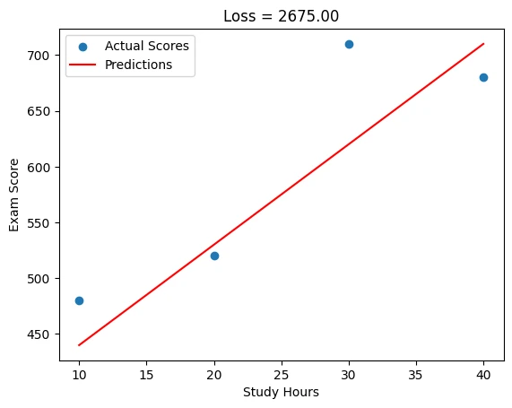

## Gradient Descent
Gradient descent is a fundamental optimization algorithm used in Machine Learning to minimize loss or prediction.
When we determine the prediction we have to predict like if we overshoot the steps it shouldn't be too large or too small.

Gradient descent is used in training many machine learning models, including linear regression, logistic regression, and neural networks.

> Gradient Descent is an algorithm used to minimize a function — especially the loss function in machine learning.

It is how our model learns.
Every time we make a prediction and it's wrong, Gradient Descent tells us how to update the parameters of our model to make it better.

Gradient Descent is like a ball rolling down the side of that bowl.

- If the slope is steep, it takes a big step.
- If it’s flat, it takes a small step.
- Eventually, it reaches the bottom — where the cost is lowest.

### Code: Gradient Descent in PyTorch with Loss Visualization using NumPy

```python
import torch
import numpy as np
import matplotlib.pyplot as plt

# Step 1: Create some sample data
x_data = torch.tensor([1.0, 2.0, 3.0, 4.0])
y_data = torch.tensor([2.0, 4.0, 6.0, 8.0])

# Step 2: Initialize weights and bias (randomly)
w = torch.tensor([0.0], requires_grad=True)
b = torch.tensor([0.0], requires_grad=True)

# Step 3: Define a learning rate
learning_rate = 0.01

# Step 4: Gradient Descent Loop
epochs = 100
losses = []

for epoch in range(epochs):
    # Forward pass: Compute predicted y
    y_pred = w * x_data + b
    
    # Compute the loss (Mean Squared Error)
    loss = torch.mean((y_pred - y_data) ** 2)
    losses.append(loss.item())  # Store the loss (convert tensor to scalar)

    # Backward pass: Compute gradients
    loss.backward()
    
    # Update weights and bias using Gradient Descent
    with torch.no_grad():  # No gradients needed for the update
        w -= learning_rate * w.grad
        b -= learning_rate * b.grad
    
    # Zero the gradients after each update
    w.grad.zero_()
    b.grad.zero_()

# Final optimized parameters after training
print(f"Optimized w: {w.item()}")
print(f"Optimized b: {b.item()}")

# Plot the loss over epochs (using NumPy for visualization)
plt.plot(np.arange(epochs), losses)
plt.title("Loss over Epochs")
plt.xlabel("Epochs")
plt.ylabel("Loss")
plt.show()
```

**Key Points:**

1. **PyTorch:**
- We use torch.tensor for both **x_data** and **y_data**, and initialize **w** and **b** with **requires_grad=True** so PyTorch can track gradients.
- The loss is calculated using PyTorch operations, and the **.backward()** function computes the gradients.
- We update **w** and **b** manually using Gradient Descent.
2. **NumPy & Matplotlib:**
- We use NumPy to visualize the loss over epochs. We store each epoch’s loss and plot it after training.

**Example Output:**
```
Optimized w: 2.0
Optimized b: -2.220446049250313e-16
```
The loss graph shows how the model improves over time, gradually converging to the correct solution.

## Loss
The loss in linear regression is how far our prediction is from the regression line. When we create the linear regression line from the given data. We get a line. When we predict, we determine a prediction. And the loss is the value of the prediction and regression line data.

In the [last tutorial]() we predicted score. Now we can check the loss.

```python
import torch

# Your data
X = torch.tensor([10., 20, 30, 40]).view(-1, 1)
Y_true = torch.tensor([480., 520, 710, 680]).view(-1, 1)

# Model's predictions (example: y = 9x + 350)
Y_pred = torch.tensor([440., 530, 620, 710]).view(-1, 1)

# Calculate MSE loss
loss = torch.mean((Y_true - Y_pred) ** 2)
print(f"Loss: {loss.item():.2f}")  # Output: Loss: 2550.00
```
output: `Loss: 2675.00`

If we show this visually
```python
import matplotlib.pyplot as plt

plt.scatter(X, Y_true, label='Actual Scores')
plt.plot(X, Y_pred, 'r-', label='Predictions')
plt.title(f"Loss = {loss.item():.2f}")
plt.xlabel('Study Hours'), plt.ylabel('Exam Score')
plt.legend()
plt.show()
```



When we give more predictions. We have more losses. And with these data our next guess can be more closer to accurate.


