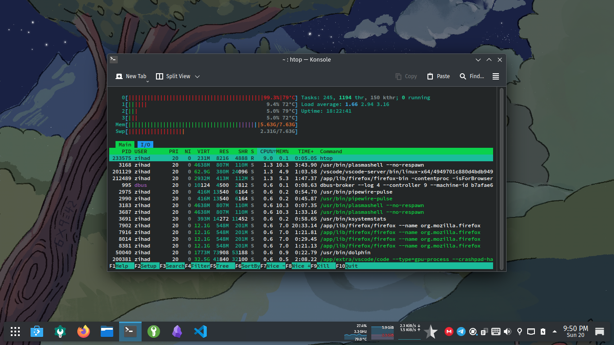
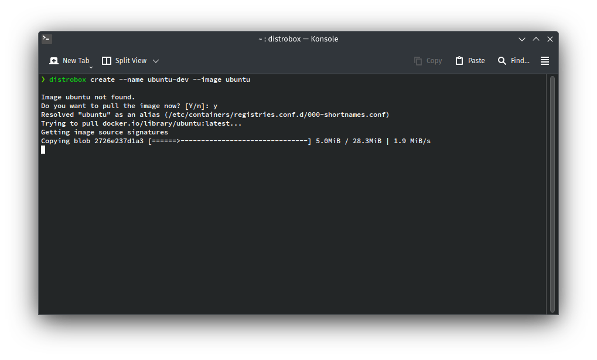

If you’re into Linux and you haven’t tried Fedora Kinoite, you’re seriously missing out. It’s not your typical Linux distro—Kinoite is like the cool, stable younger brother of Fedora, built on an immutable base using rpm-ostree and powered by the beautiful KDE Plasma 6 desktop.

I installed Fedora Kinoite 42 on my laptop after the stable release, and honestly—it’s been a refreshing experience. In this post, I’ll break down everything from features to performance, with a few screenshots to give you a real feel.

## What is Fedora Kinoite? 

Let me explain this in simple terms.

Fedora Kinoite is:
- A Fedora Spin with KDE Plasma as the desktop
- Based on rpm-ostree (immutable or atomic updates)
- Uses Flatpaks an Appimages for apps (sandboxed and safe)
- Designed for **stability**, **security**, and **for everyone**

If you’ve used Fedora Silverblue, it’s basically the KDE version of that. But in my opinion, KDE makes it way more usable, especially for people who like a bit of customization.



## ✨ What’s New in Fedora Kinoite 42? 

Fedora Kinoite 42, released on April 15, 2025, brings several exciting updates.

### Core System Updates:
- **composefs enabled by default:**  Following Fedora CoreOS, Kinoite 42 now mounts system content using composefs. This modern Linux filesystem is designed for read-only, composable, and efficient file systems, enhancing the stability and predictability of the system.

- **Static GRUB configuration:** To better accommodate composefs, Fedora 42 rewrites existing installations to a static grub.cfg. This eliminates duplicate menu entries that could occur on systems upgraded from Fedora 41. The migration happens automatically on the first boot after the upgrade.

- **Installer-set keyboard layout for LUKS unlock:** The Anaconda installer now persists the chosen keyboard map as a kernel argument. This ensures that the passphrase you enter at the early-boot LUKS prompt matches your selected locale.

**Desktop Environment:**
- **KDE Plasma 6.3:** Kinoite 42 ships with the latest KDE Plasma 6.3 desktop environment, along with KDE Frameworks 6.11 and the Gear 24.12.3 applications collection. This brings numerous enhancements and new features to the user experience.
- **Revamped graphics tablet settings:** Artists and digital creators will appreciate the improved and more comprehensive settings for graphics tablets.
- **Smarter fractional scaling algorithms:** For users with HiDPI displays, the fractional scaling should be more intelligent and provide a smoother visual experience.
- **Ability to restore virtual desktop layouts per activity:** This allows for more customized and efficient workflows by remembering virtual desktop arrangements for different activities.
- **Grouped notifications:** Notifications from the same application are now grouped together in a list, preventing the notification area from becoming too cluttered.

**Other Notable Changes:**
- **Automatic Updates enabled by default:** Fedora Kinoite 42 now has automatic updates enabled by default, ensuring users stay up-to-date with the latest fixes and features with minimal manual intervention.
- **ibus-speech-to-text:** This new input method enables voice dictation in any application supporting IBus. It offers offline voice recognition, supports multiple languages via downloadable models, and integrates with the existing IBus infrastructure.


## Developer Friendly – With Toolbox and Distrobox
Now, you might think: “If the system is immutable, how will I do development?”

That’s where Toolbox and Distrobox come in.

### Toolbox
Toolbox lets you create a mutable development container based on Fedora where you can install anything using `dnf`:
```sh
toolbox create
toolbox enter
```
Now you’re inside a container where you can do whatever you want—install compilers, run servers, build code—without touching the base system.

### Distrobox
Want to use Ubuntu inside Fedora Kinoite? Distrobox lets you do that easily:
```sh
distrobox create --name ubuntu-dev --image ubuntu
```
It’s perfect for developers or students working on multiple platforms.




### Gaming on Kinoite – Yes, It Works

Yes, you can game on Kinoite. Thanks to Flatpak, you can install **Steam**, **Lutris**, or even** Heroic Games Launcher** very easily.

Flatpak Steam + Proton works great. Most games run just like they do on other Fedora editions.

For NVIDIA users: Fedora Kinoite supports **akmods**, so you can install proprietary drivers too.

Check out [Gaming guide for Fedora Atomic (Silverblue, Kinoite) 2025]() for more about Fedora Gaming on Kinoite.

### Security and Stability:
Fedora Kinoite shines in two areas:
- Security: Apps are sandboxed. The system is read-only.
- Stability: Updates are atomic and never leave you with a half-broken system.

If anything goes wrong, just boot into the previous version and keep working.
It’s almost like having a backup every time you upgrade.

## Customization and Layering Packages
Even though the system is immutable, it’s still customizable.

Want to install a package that isn’t available as Flatpak? Just use:
```sh
rpm-ostree install fastfetch htop
```

## Conclusion
Whether you’re a student, a developer, or just someone who wants a hassle-free KDE desktop, Kinoite delivers. The immutable design may seem different at first, but once you get used to it—you won’t want to go back.