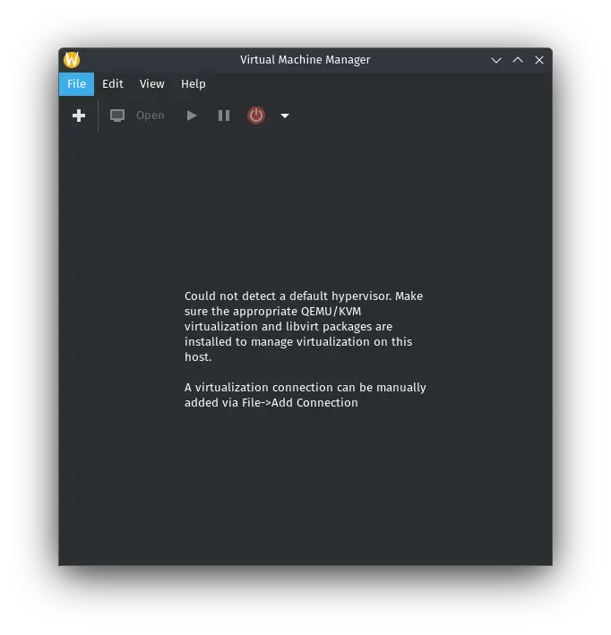
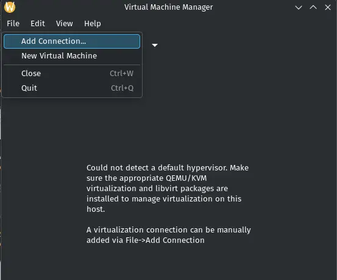
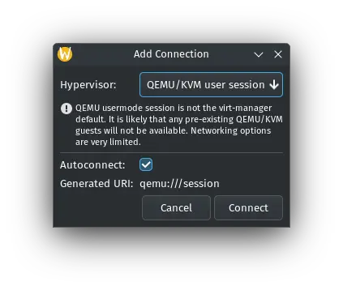
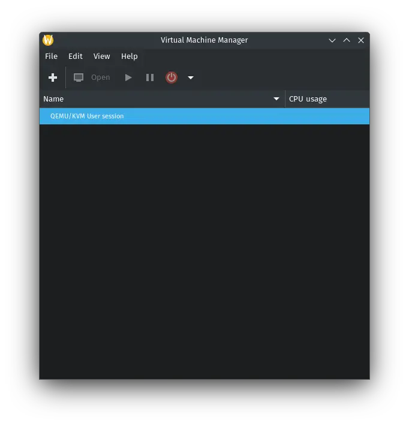
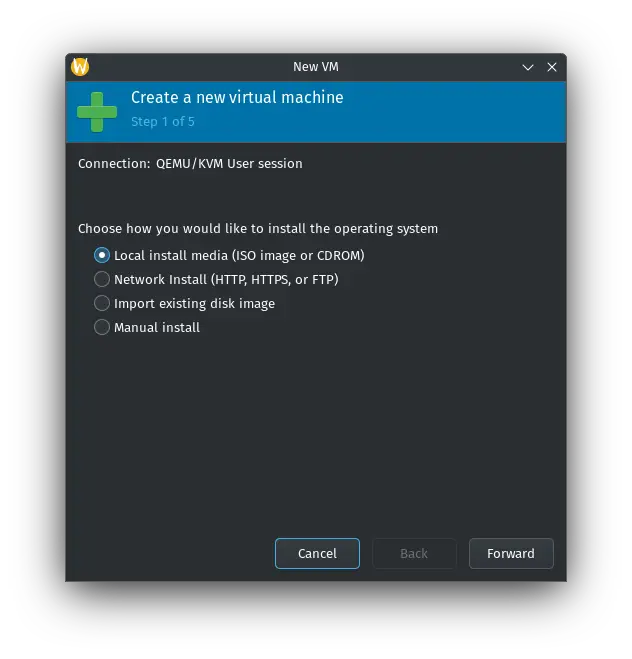

If you're running Fedora Silverblue, Kinoite, or any other immutable Fedora variant, installing traditional software can be a bit different from the usual package manager approach. Luckily, Virt Manager, a popular tool for managing virtual machines, is available on Flathub as a Flatpak package, making it easy to install on your system.

In this guide, I'll walk you through the simple steps to install Virt Manager from Flathub, get your virtual machines up and running, and optimize the setup using Toolbox on your immutable desktop. Whether you're testing other operating systems, running legacy apps, or exploring the world of virtualization, this post will help you get started in no time.

## Installation
Make your you have (flathub)[https://flathub.org/setup/Fedora] enabled.

1. To install Virt Manager, run the following command in your terminal:
```sh
flatpak install flathub org.virt_manager.virt-manager
```

2. Now that you have Virt Manager installed, you’ll need to install an additional extension to enable QEMU, which is a necessary backend for running virtual machines. This extension helps Virt Manager interact with QEMU/KVM, allowing you to manage virtual machines effectively.  
To install the QEMU **Extension** for Virt Manager, use the following command:
```sh
flatpak install org.virt_manager.virt_manager.Extension.Qemu
```
> This only allow `libvirt` user instance

## Usage
Run Virt Manager from application launcher.

You would see warning: Could not detect a default hypervisor. Because it can only run user instance.  
  

Let's add **Add Connection**  
  

Add `QEMU/KVM user session`  
  

You should see user session created.  
  

Now you can start creating VM as usuals
  

Hope this guide helped you get started! If you have any questions, feel free to drop them in the comments. Happy virtualizing! 😄