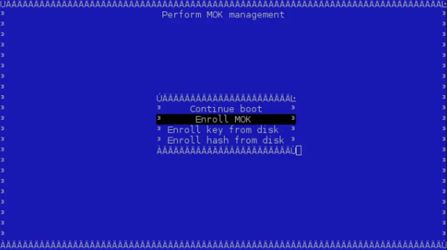

Installing the NVIDIA driver on Fedora is honestly one of the most confusing tasks I’ve faced. Unlike Ubuntu or Arch, where tons of guides are available, Fedora users (especially those using Workstation, KDE spins, or Silverblue) often struggle to find a clear, updated guide that just works. I wasted hours on random Reddit threads, outdated blog posts, and YouTube videos that didn’t help. So, I decided to write this complete guide based on my experience—step-by-step, no unnecessary bloat, just what you need to get your NVIDIA GPU running properly on Fedora in 2025.

In this guide, we’ll go through 3 working methods to install NVIDIA drivers on Fedora in 2025:

  **1. The RPM Fusion Way – the most popular and Fedora-friendly method.**

  **2. The Official NVIDIA Installer – a more manual method for specific needs.**

  **3. Third-party Tools – like Negativo17 or akmods (especially useful for Silverblue and other atomic desktops).**

Let’s dive in and finally get that GPU working properly!

## Prerequisites

Before we begin, We must identify our system.

### **Check NVIDIA GPU model**

To check for a GPU, open the terminal and run the following command:
```sh
lspci |grep -E "VGA|3D|NVIDIA"
```
This command will search for any NVIDIA GPUs on your system. If your system has an NVIDIA GPU, you will see the following output:
```sh
01:00.0 VGA compatible controller: NVIDIA Corporation GM107M [GeForce GTX 850M] (rev a2)
```
If you see no output, it means that your system does not have an NVIDIA GPU.

### **Check if secure boot is enabled**

Run the following command in the terminal to check Secure Boot status:
```sh
mokutil --sb-state
```

This command should show something like this:
```sh
SecureBoot disabled
Platform is in Setup Mode
```

For me it was disabled from UEFI boot menu. But for you if it is __enabled__. Follow the secure boot guide.


## Method 1: RPM Fusion [Recommanded]

If you have secureboot enabled. Follwo this guide.

### Secure Boot key enrollment [RPM Fusion]

Install the following tools: 
```sh
sudo dnf install kmodtool akmods mokutil openssl 
```w

To generate a key with the default values: 

```sh
sudo kmodgenca -a
```

Now you need to enroll the public key in MOK, enroll the new keypair with certificate with the command 

```sh
sudo mokutil --import /etc/pki/akmods/certs/public_key.der
```

Mokutil asks to generate a password to enroll the public key. You will need this soon. 

Rebooting the system is needed for MOK to enroll the new public key. 

```sh
systemctl reboot 
```

On the next boot MOK Management is launched and you have to choose "__Enroll MOK__"



Choose "__Continue__" to enroll the key or "View key 0" to show the keys already enrolled.

Confirm enrollment by selecting "__Yes__".

You will be invited to enter the password generated above.

**WARNING: keyboard is mapped to QWERTY!**

The new key is enrolled, and the system asks you to reboot. 

Wait for modules to build! You can check build process via htop, or by typing: 
```sh
modinfo -F version nvidia 
```

Reboot

### Install Driver

This is the recommanded guide. RPM Fusion is a third-party software repository for Fedora, Red Hat, and related distributions. It provides packages that Fedora does not include by default due to legal, licensing, or policy reasons — such as proprietary drivers (like NVIDIA), media codecs, and extra software.

- **Enable RPM Fusion on Fedora**

```sh
# Enable both Free and Nonfree repositories
sudo dnf install \
https://mirrors.rpmfusion.org/free/fedora/rpmfusion-free-release-$(rpm -E %fedora).noarch.rpm \
https://mirrors.rpmfusion.org/nonfree/fedora/rpmfusion-nonfree-release-$(rpm -E %fedora).noarch.rpm
```

### For Newer GPU from 2014

This driver is suitable for any GPU found in 2014 and later. 

- **Install NVIDIA Driver from rpmfusion**

After enabling rpmfusion, you can install the NVIDIA driver easily with:

```sh
sudo dnf update
sudo dnf install akmod-nvidia
```

This is optional package. But if you want __cuda/nvdec/nvenc__ support install this. If you don't know what these are you can skip this package.

```sh
sudo dnf install xorg-x11-drv-nvidia-cuda # CUDA support
```

### **Legacy GeForce 600/700**

This driver is suitable for any NVIDIA Kepler GPU found between 2012 and 2014 

```sh
sudo dnf update
sudo dnf install xorg-x11-drv-nvidia-470xx akmod-nvidia-470xx
sudo dnf install xorg-x11-drv-nvidia-470xx-cuda #optional for cuda up to 11.4 support
```

### Legacy GeForce 400/500

This driver is suitable for any NVIDIA Fermi GPU found between 2010 and 2012 

```sh
sudo dnf update
sudo dnf install xorg-x11-drv-nvidia-390xx akmod-nvidia-390xx
sudo dnf install xorg-x11-drv-nvidia-390xx-cuda #optional for cuda up to 9.2 support
```

Rebot system to take effect:

```sh
reboot
```

Check if NVIDIA is installed:  
Run
```sh
nvidia-smi
```
The output should be something like  

```
+---------------------------------------------------------------------------------------+
| NVIDIA-SMI 550.78              Driver Version: 550.78        CUDA Version: 12.3       |
|-------------------------------+----------------------+-------------------------------+
| GPU  Name        Persistence-M| Bus-Id        Disp.A | Volatile Uncorr. ECC |
| Fan  Temp  Perf  Pwr:Usage/Cap|         Memory-Usage | GPU-Util  Compute M.     |
|===============================+======================+===============================|
|   0  GeForce GTX 850M    Off  | 00000000:01:00.0 N/A |                  N/A          |
| N/A   45C    P8     N/A /  N/A|      0MiB / 2048MiB  |      0%      Default         |
+-------------------------------+----------------------+-------------------------------+

+---------------------------------------------------------------------------------------+
| Processes:                                                                  GPU Memory |
|  GPU       PID   Type   Process name                               Usage              |
|=======================================================================================|
|  No running processes found                                                     |
+---------------------------------------------------------------------------------------+
```

## Method 2: From NVIDIA directly [Advanced]

From NVIDIA there's 2 way to install driver. 

### **From NVIDIA Cuda RPM repo**

Check if NVIDIA made this driver [available for Fedora branch](https://developer.download.nvidia.com/compute/cuda/repos/)

**Import Nvidia CUDA Repository for Fedora:**
```sh
sudo curl -o /etc/yum.repos.d/cuda-fedora$(rpm -E %fedora).repo "https://developer.download.nvidia.com/compute/cuda/repos/fedora$(rpm -E %fedora)/x86_64/cuda-fedora$(rpm -E %fedora).repo"
```

This will download the nvidia driver repo to `/etc/yum.repos.d`

Check what fedora version you have with `hostnamectl`.  

Now from this repo. __2 types__ of drivers available. Install __any one__ of them. __CUDA__ is only available with Proprietary.
Decide whether you want the open kernel modules (for __Turing__ and newer GPUs) or proprietary modules (required for __Maxwell__, __Pascal__, and __Volta__ GPUs). Open modules are the default for supported hardware.

1. NVIDIA Proprietary. 
2. NVIDIA Open.

#### **To Install drivers NVIDIA Proprietary**

```sh
sudo dnf update
sudo dnf install --allowerasing nvidia-driver kmod-nvidia-latest-dkms
sudo dnf install --allowerasing cuda-drivers # optional, for complete driver with cuda support
sudo dnf install cuda-toolkit 
```

#### **To Install drivers NVIDIA Open**

```sh
sudo dnf update
sudo dnf install --allowerasing nvidia-driver kmod-nvidia-open-dkms
```

Reboot to activate the new drivers.

```sh
reboot
```

### **From NVIDIA (.Run file) [Super Advanced]**
Guide to install official .run deriver package.


#### Secure boot (For Official NVIDIA)

If we want to preserve secureboot for official nvidia driver installation. We must sign the driver.  
Note that, if other OSs are installed, e.g., Windows, we may lose those installations when the secure boot is disabled.  
To sum up, we sign the driver using the following commands:
```sh
openssl req -new -x509 -newkey rsa:2048 \
  -keyout Nvidia.key \
  -outform DER -out Nvidia.der \
  -nodes -days 100000 -subj "/CN=Graphics Drivers"
```
Creates a self-signed __certificate__ and __private key__, used primarily for Secure Boot kernel module signing for NVIDIA driver.

Imports a certificate into the Machine Owner Key (MOK) list, which is required to load unsigned or custom kernel modules (like the NVIDIA driver) on systems with Secure Boot enabled.

```sh
sudo mokutil --import Nvidia.der
```

This command requires you create password for enrolling. Afterwards, reboot your computer, in the next boot, the system will ask you enroll, you enter your password (which you created in this step) to enroll it.

Download the appropriate driver for your GPU from [NVIDIA's official website](https://www.nvidia.com/en-us/drivers/)

#### Install Driver

Manual Driver Search


Find Driver


Download the driver

 Display Driver 570.153.02 Linux 64-bit NVIDIA.webp>)

Once you download the __.run__ file.

Open the terminal.

Install dependencies:

```sh
sudo dnf install gcc
```

Disable nouveau

```sh
echo -e "blacklist nouveau\noptions nouveau modeset=0" | sudo tee /etc/modprobe.d/blacklist-nouveau.conf
sudo dracut --force # Rebuilds the initramfs
```

> Below command will close your current session and open TTY session. Save your work.
{: .prompt-warning }

Switch to CLI mode by disabling the GUI mode:

```sh
sudo systemctl isolate multi-user.target # switches to TTY mode. Login with user account.
```
Then proceed to install.
Go to the directory where the file is. For me it is Downloads folder. Make it executable. And run:

```sh
cd ~/Downloads
sudo chmod +x NVIDIA-Linux-x86_64-570.153.02.run
sudo sh ./NVIDIA-Linux-x86_64-570.153.02.run
```

If you have secure boot enabled and you have generated sighning key. Run the installer like this.
```sh
sudo sh ./NVIDIA-Linux-x86_64-570.153.02.run
--module-signing-secret-key=/path/to/generated/Nvidia.key 
--module-signing-public-key=/path/to/generated/Nvidia.der
```

If you skipped previous nouveau driver disable step. You would be asked to disable automatically for you.


When asked for **Would you like to register the kernel module sources with DKMS?**  
Give __YES__.


If asked **Would you like to run the nvidia-xconfig utility to automatically update the x config...?**  
Give __YES__.


After installation `reboot` the system.

If you're still in the terminal and want to go back to your desktop without rebooting:  
```sh
sudo systemctl isolate graphical.target
```
This will restart your display manager (like GDM or SDDM) and return you to the login screen.

Reboot the system to load the installed driver.

#### Install CUDA Toolkit
The [NVIDIA website contains](https://developer.nvidia.com/cuda-downloads?target_os=Linux&target_arch=x86_64&Distribution=Fedora&target_version=37&target_type=rpm_local) all the instructions for all supported operating systems. In the case of Fedora 39, we can apply the following commands:
```sh
wget https://developer.download.nvidia.com/compute/cuda/12.9.0/local_installers/cuda-repo-fedora41-12-9-local-12.9.0_575.51.03-1.x86_64.rpmsudo 
rpm -i cuda-repo-fedora41-12-9-local-12.9.0_575.51.03-1.x86_64.rpm
sudo dnf clean all
sudo dnf -y install cuda-toolkit-12-9
```

## Method 3: Fedora Atomic

This method is only for Fedora Atomic devices.

Enable RPM Fusion:
```sh
sudo rpm-ostree install https://mirrors.rpmfusion.org/free/fedora/rpmfusion-free-release-$(rpm -E %fedora).noarch.rpm https://mirrors.rpmfusion.org/nonfree/fedora/rpmfusion-nonfree-release-$(rpm -E %fedora).noarch.rpm
```

**Secure boot**
```sh
rpm-ostree install --apply-live rpmdevtools akmods

sudo kmodgenca # generate MOK
sudo mokutil --import /etc/pki/akmods/certs/public_key.der # import key. set password
```

Install `akmods-key` from [here](https://github.com/CheariX/silverblue-akmods-keys)

```sh
## Clone this project
git clone https://github.com/CheariX/silverblue-akmods-keys
cd silverblue-akmods-keys

### Build akmods-keys
sudo bash setup.sh
rpm-ostree install akmods-keys-0.0.2-8.fc$(rpm -E %fedora).noarch.rpm
```

Reboot

Install drivers

```sh
sudo rpm-ostree install akmod-nvidia xorg-x11-drv-nvidia
sudo rpm-ostree install akmod-nvidia xorg-x11-drv-nvidia-cuda #optional if using nvidia-smi or cuda
sudo rpm-ostree kargs --append=rd.driver.blacklist=nouveau --append=modprobe.blacklist=nouveau --append=nvidia-drm.modeset=1 # this might not be needed at some point when ostree systems will support the standard way to specify this.
```

Reboot to load driver


## Troubleshooting

Once the NVIDIA driver is installed, it's important to monitor system updates carefully. When the kernel is updated, the NVIDIA kernel module may need to be rebuilt — typically handled automatically by tools like __akmods__ or __DKMS__. However, if you encounter issues like a black screen or notice the system has reverted to the Nouveau driver, check that the correct kernel headers are installed for your current kernel version. If needed, you can manually initiate a module rebuild.

```sh
sudo akmods --force
sudo dracut --force
sudo reboot
```

To uninstall the NVIDIA driver (RPM Fusion method):

```sh
sudo dnf remove akmod-nvidia xorg-x11-drv-nvidia\*
```

To uninstall from NVIDIA source

```sh
sudo dnf remove nvidia-driver\* kmod-nvidia\* xorg-x11-drv-nvidia\* cuda\*
```

Enable default __nouveau driver__ again. In case you ended up with black screen
```sh
sudo rm -f /etc/modprobe.d/blacklist-nouveau.conf
```

Rebuild initramfs
```sh
sudo dracut --force
```

Reboot:

```sh
sudo reboot
```

If you want to revert back to nouveau in Fedora atomic. Remove the layered packages.  
And remove the modules
```sh
sudo rpm-ostree kargs --delete=rd.driver.blacklist=nouveau --delete=modprobe.blacklist=nouveau --delete=nvidia-drm.modeset=1
```


**Sources:** 

[Official guide](https://docs.nvidia.com/cuda/cuda-installation-guide-linux/#fedora-installation)  
[Secureboot Guide](https://rpmfusion.org/Howto/Secure%20Boot?ref=allthings.how#Secure_Boot)  
[Machine Owner Key Enrollment](https://docs.fedoraproject.org/en-US/quick-docs/mok-enrollment/)   
[Installing the NVIDIA Drivers](https://jjfumero.github.io/posts/2023/12/nvidia-cuda-drivers-fedora39)
