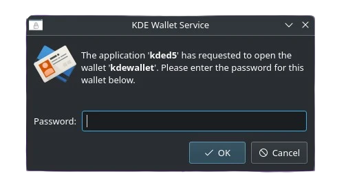
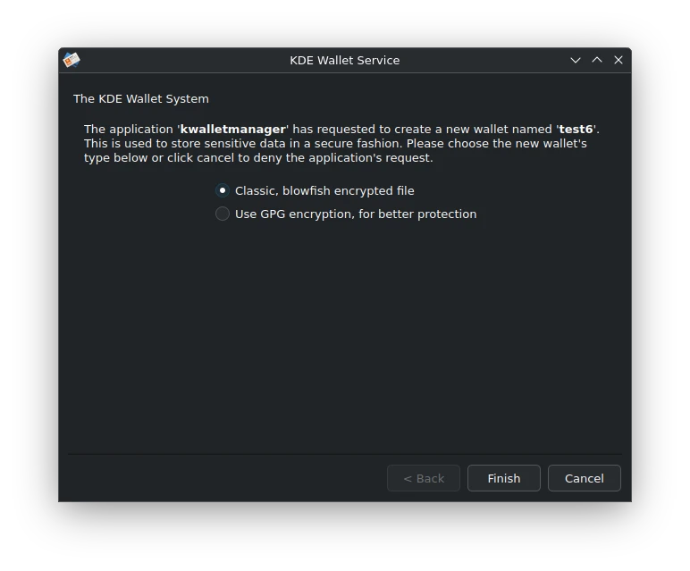

If you use KDE Plasma, you’ve probably run into this little annoyance — every time you log in, KDE Wallet pops up asking for a password. It doesn’t matter if you’re just trying to open your browser or sync your email, the popup is always there, interrupting your workflow.

The good news? This isn’t a bug — it’s just KDE Wallet doing its job to store your passwords securely. The bad news? By default, it’s set up in a way that makes it a little too eager for your attention. In this guide, I’ll show you how to configure KDE Wallet so it works quietly in the background, without asking you for a password every time you start your desktop.

When I first installed Debian 13 with KDE Plasma, everything looked perfect — smooth animations, a clean interface, and all the customization options I love about KDE. But then came the first reboot… and KDE Wallet decided to greet me with a password popup. Every. Single. Time.



At first, I thought I had messed up the installation or missed a package, but it turns out this is a common issue many Debian KDE users face right after a fresh install. In this post, I’ll share exactly how I fixed it so you can enjoy Debian 13 KDE without that annoying password prompt at every login.

Let's install kdewallet

For Debian
```sh
sudo apt install kwalletmanager
```

1. Open Kwalletmanager. Delete previous wallet from `File -> Delete Wallet...`.
2. Create New Wallet `File -> New Wallet`. Give any name. Default is `kdewallet`.
3. Select `Classic, blowfish encrypted file`. We will avoid GPG encryption. Because it isn't integrated well with kde.

    

4. Set **Password**. Password must be **same as user password** that you have logged in. This is the most **importand** step.

If you done all this you should be good to go. Reboot to try. 