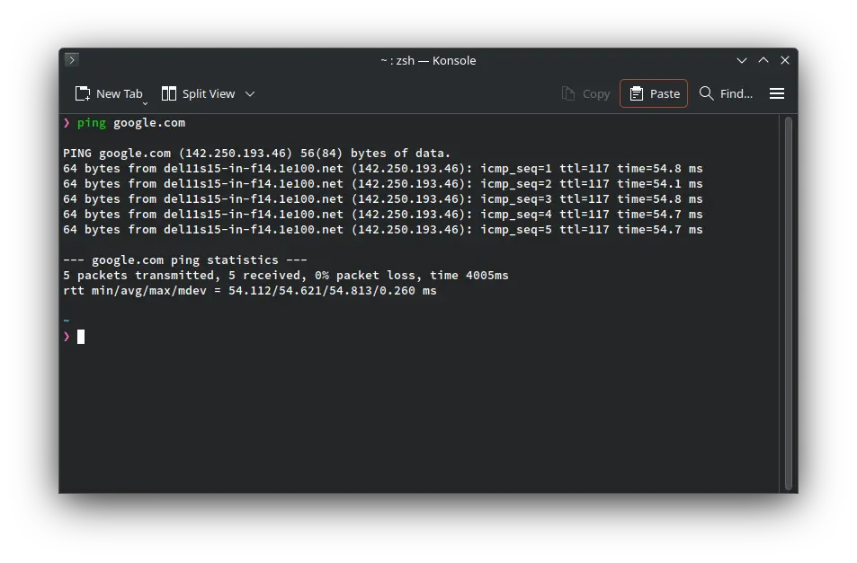

In this guide, you’ll learn not only how to use the ping command to find the IP address of a website or server, but also some handy tips and tricks you can try with it. These steps work across Windows, Mac, and Linux.

Windows: Open Command Prompt

Mac & Linux: Open Terminal

Below are several examples of the ping command. No matter which operating system you’re on, the commands and options work the same way.

### 1. Basic ping Command
Start with a simple ping to Google’s domain to check its IP address:
```sh
ping google.com
```

By default, this command keeps running continuously. To stop it, press Ctrl + C on Windows or Command + C on Mac.



### 2. Ping an IP Address
You can ping a specific IP address to check your internet connection. For example, try pinging a popular DNS server:

```sh
ping 8.8.8.8
```

This helps verify whether your device can reach external servers directly.

### 3. Ping at an Interval
By default, the ping command sends a request every 1 second. You can change the interval between pings using the -i option:

```sh
ping -i 5 google.com   # Ping every 5 seconds
ping -i 0.1 google.com # Ping every 0.1 seconds
```

This allows you to control how frequently your system sends ping requests.

### 4. Ping Your localhost
Sometimes it’s helpful to ping your own computer to check local network functionality. You can do this using either the hostname or the IP address:
```sh
ping localhost
ping 127.0.0.1
```
This verifies that your network stack is working correctly on your machine.

### 5. Stop Pinging After a Count
By default, ping runs continuously until you stop it manually. To limit the number of pings, use the `-c` option. For example, the following command will send 3 ping requests and then stop:
```sh
ping -c 3 google.com
```

This is useful when you just want a quick check without running ping indefinitely.

### 6. Ping with an Audible Beep
The `-a` option makes ping play a sound each time a reply is received, giving an audible alert while the command runs.
```sh
ping -a google.com
```

### 7. Change Ping Packet Size
By default, ping sends packets of 64 bytes, which includes an 8-byte header. You can change the packet size using the -s option. For example, the following command sends a packet of 108 bytes (including the header):
```sh
ping -s 100 localhost
```

### 8. Ping IPv4
Some versions of ping let you force the use of IPv4, ensuring you receive an IPv4 address in the response. You can do this with either of the following commands:

```sh
ping -4 google.com
ping4 google.com
```
This is helpful when a domain has both IPv4 and IPv6 addresses, and you want to test only IPv4 connectivity.

### 9. Ping IPv6

Some versions of ping let you force the use of IPv6, which ensures the response comes from an IPv6 address. You can do this using commands like:

```sh
ping -6 google.com
ping6 google.com
```
