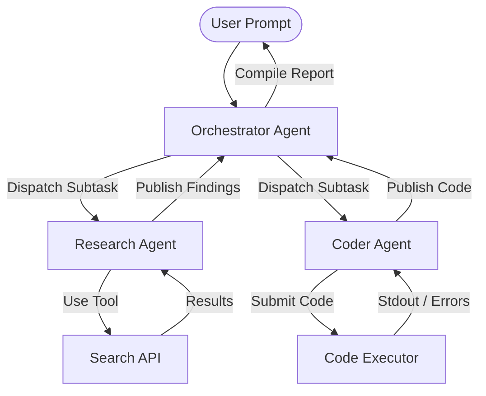

In the early days of the generative AI boom, a new job title took the tech industry by storm: **Prompt Engineer**. Teams of developers and hobbyists spent hours tweaking adjectives, appending `"think step-by-step"`, or threatening LLMs with hypothetical fines to squeeze out better performance. 

But prompt engineering was always a transitional phase. It was a bridge between the era of static APIs and the era of truly **Autonomous AI Agent Networks**.

Today, we are witnessing a paradigm shift. We are moving away from monolithic, single-prompt instructions toward decentralized networks of specialized agents that communicate, negotiate, and collaborate to solve complex, multi-step problems.

In this post, we'll explore why prompt engineering is dying, the architecture of autonomous agent networks, and how you can build a lightweight, event-driven agent network in Python from scratch.

---

## Why Prompt Engineering is Fragile and Inefficient

Prompt engineering has several fundamental flaws:

1. **Model Lock-in:** A highly engineered prompt that works perfectly on Claude 3.5 Sonnet might completely fail or hallucinate on GPT-4o or Gemini 1.5 Pro.
2. **Linear Context Scaling:** Forcing a single model instance to handle planning, research, coding, and quality assurance leads to context dilution, attention drop-off, and high latency.
3. **Lack of Dynamic Orchestration:** Complex software engineering tasks aren't solved in a single prompt; they require iterative loops of executing, testing, and debugging.

Instead of writing a 1,000-line prompt trying to make a single LLM wear five different hats, the modern approach is to build **networks of simple, specialized agents**. Each agent has one job, access to specific tools, and a local context window.

---

## Architecture of an Agent Network

An autonomous agent network is composed of three core entities:

1. **Agent Nodes:** Individual LLM instances wrapped in a control loop. Each node has a persona, localized system instructions, and a set of tools (APIs, filesystem access, sandboxed runtimes).
2. **The Message Broker / Router:** The communication layer. Agents do not talk to each other directly in an ad-hoc manner; they publish events and send structured messages via a router or queue.
3. **State Management:** The shared memory. This can be episodic (individual agent history) or global (a shared workspace or key-value store containing the progress of the overall goal).

### Topologies of Cooperation

Depending on the task, you can arrange your network in different topologies:

*   **Hierarchical (Orchestrator-Worker):** A central coordinator receives the user input, breaks it down into sub-tasks, dispatches them to specialized worker agents, and compiles the final result.
*   **Chains / Pipelines:** A linear sequence where Agent A's output becomes Agent B's input (e.g., Researcher -> Writer -> Editor).
*   **Peer-to-Peer / Collaborative:** Agents subscribe to topics and self-delegate tasks, debating and voting on solutions.

Let's visualize a typical **Hierarchical & Collaborative** topology:



---

## Building a Lightweight Agent Network in Python

Let's build a functional, event-driven agent network. We will create:
1. A `Message` class representing communication.
2. An `AgentNode` base class.
3. An `AgentNetwork` broker.
4. Two specialized agents: a **Researcher** and a **Synthesizer** cooperating to answer a query.

### 1. Defining the Message and Network Broker

The broker will route messages between agents using a simple pub-sub pattern.

```python
import asyncio
from typing import Dict, List, Callable, Any
from dataclasses import dataclass, field

@dataclass
class Message:
    sender: str
    recipient: str
    topic: str
    content: Any
    metadata: dict = field(default_factory=dict)

class AgentNetwork:
    def __init__(self):
        self.agents: Dict[str, Any] = {}
        self.subscriptions: Dict[str, List[Callable]] = {}

    def register_agent(self, agent_name: str, agent: Any):
        self.agents[agent_name] = agent
        print(f"[Network] Registered Agent: {agent_name}")

    def subscribe(self, topic: str, callback: Callable):
        if topic not in self.subscriptions:
            self.subscriptions[topic] = []
        self.subscriptions[topic].append(callback)

    async def publish(self, message: Message):
        print(f"[Network] Broadcast: {message.sender} -> {message.recipient} on '{message.topic}'")
        
        # 1. Direct routing
        if message.recipient in self.agents:
            asyncio.create_task(self.agents[message.recipient].receive(message))
            
        # 2. Topic subscriptions
        if message.topic in self.subscriptions:
            for callback in self.subscriptions[message.topic]:
                asyncio.create_task(callback(message))
```

### 2. Implementing the Base Agent Node

Each agent runs its own asynchronous processing loop.

```python
class AgentNode:
    def __init__(self, name: str, network: AgentNetwork):
        self.name = name
        self.network = network
        self.inbox = asyncio.Queue()
        self.network.register_agent(name, self)
        asyncio.create_task(self.run())

    async def receive(self, message: Message):
        await self.inbox.put(message)

    async def run(self):
        while True:
            message = await self.inbox.get()
            try:
                await self.process_message(message)
            except Exception as e:
                print(f"[{self.name}] Error processing message: {e}")
            finally:
                self.inbox.task_done()

    async def process_message(self, message: Message):
        raise NotImplementedError("Subclasses must implement process_message")
```

### 3. Creating Specialized Agents

For this demonstration, we'll simulate the LLM call using basic rules to focus on the message passing and delegation structure.

```python
class ResearchAgent(AgentNode):
    def __init__(self, name: str, network: AgentNetwork):
        super().__init__(name, network)
        # Subscribe to research requests
        self.network.subscribe("research_requests", self.handle_research)

    async def handle_research(self, message: Message):
        # Prevent self-loops
        if message.sender == self.name:
            return
            
        query = message.content
        print(f"[{self.name}] Researching query: '{query}'...")
        
        # Simulate an API lookup or web search
        await asyncio.sleep(1.5) 
        research_data = {
            "query": query,
            "facts": [
                "Autonomous AI Agent Networks use event-driven micro-agents.",
                "They communicate via standardized message-passing layers instead of long prompt contexts.",
                "This architecture reduces hallucination rates by dividing complex tasks into subtasks."
            ],
            "confidence": 0.95
        }
        
        # Send results back to the sender
        response = Message(
            sender=self.name,
            recipient=message.sender,
            topic="research_results",
            content=research_data
        )
        await self.network.publish(response)

    async def process_message(self, message: Message):
        # Handle direct messages if needed
        pass
```

Let's now implement the `SynthesizerAgent` which coordinates the task, prompts the research agent, and compiles the final blog post draft.

```python
class SynthesizerAgent(AgentNode):
    def __init__(self, name: str, network: AgentNetwork):
        super().__init__(name, network)
        self.pending_tasks: Dict[str, Any] = {}

    async def start_synthesis_task(self, task_id: str, topic: str):
        self.pending_tasks[task_id] = {
            "topic": topic,
            "research": None,
            "status": "pending"
        }
        
        # Request research from the network
        req = Message(
            sender=self.name,
            recipient="Researcher",
            topic="research_requests",
            content=topic,
            metadata={"task_id": task_id}
        )
        await self.network.publish(req)

    async def process_message(self, message: Message):
        if message.topic == "research_results":
            data = message.content
            # Locate the pending task (simulated via metadata or query matching)
            for task_id, task in self.pending_tasks.items():
                if task["topic"] == data["query"]:
                    print(f"[{self.name}] Received research results. Compiling final output...")
                    task["research"] = data["facts"]
                    task["status"] = "completed"
                    
                    # Generate the draft based on compiled facts
                    draft = f"Draft on: {task['topic']}\n"
                    draft += "===================================\n"
                    for i, fact in enumerate(task["research"], 1):
                        draft += f"{i}. {fact}\n"
                    
                    print(f"\n--- FINAL COMPILED DRAFT ---\n{draft}\n----------------------------\n")
```

### 4. Running the Network

Let's boot the network and trigger a research task.

```python
async def main():
    # Initialize the broker
    network = AgentNetwork()

    # Spin up agents
    researcher = ResearchAgent("Researcher", network)
    synthesizer = SynthesizerAgent("Synthesizer", network)

    # Allow startup time for tasks
    await asyncio.sleep(0.1)

    # Start a synthesis task
    await synthesizer.start_synthesis_task(
        task_id="task_101", 
        topic="How to build Autonomous AI Agent Networks"
    )

    # Keep the event loop running to observe the asynchronous interactions
    await asyncio.sleep(2)

if __name__ == "__main__":
    asyncio.run(main())
```

---

## Best Practices for Designing Agent Networks

If you are planning to move your application stack from prompt chains to agent networks, keep these design patterns in mind:

1.  **State Schema Enforcement:** Use Pydantic or JSON Schema to validate the outputs of each agent. LLMs can occasionally return invalid keys; a strict schema ensures the broker never breaks.
2.  **Graceful Degeneracy & Deadlines:** Set maximum execution loop counts (e.g., max 5 iterations for coding agents) and timeouts to prevent runaway API billing.
3.  **Human-in-the-Loop (HITL) Interceptors:** Design your broker so that critical steps (e.g., database writes, payment triggers, email dispatches) pause the loop and request manual approval.
4.  **Semantic Routing:** Use embedding search to route tasks to the agent best equipped for the query, dynamically scaling up your network topology based on incoming workloads.

## The Future of Software Development

As autonomous networks become the standard, the developer's job is evolving. We will spend less time debugging string templates or adjusting temperatures, and more time:

*   Designing **agent topologies** and communication protocols.
*   Building robust **API interfaces and sandboxes** for agents to execute code safely.
*   Monitoring agent-to-agent negotiation dynamics and semantic drift.

Prompt engineering got us here, but agent networks are where AI-driven software architecture begins.
