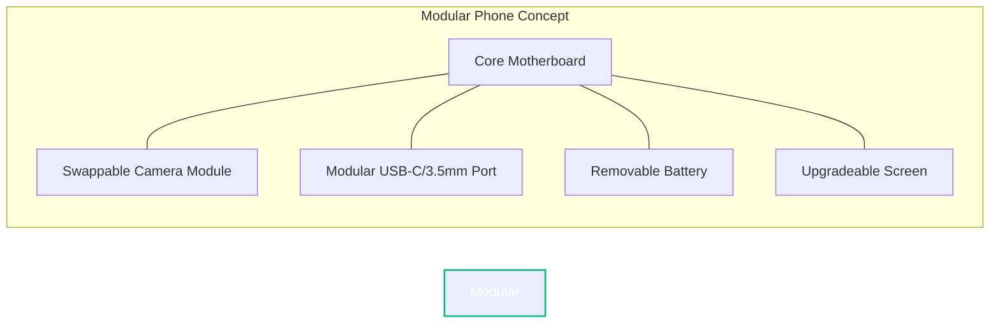

Step into a Silicon Valley boardroom, and you’ll see a sea of glowing Apple logos. But walk down the hall to the engineering department, where the systems architects, kernel developers, and cybersecurity researchers sit, and the landscape changes dramatically. 

Among hardware and software engineers, Apple’s closed ecosystem is increasingly seen as a cage. While the iPhone is a masterpiece of consumer engineering, it severely limits user autonomy, hardware repairability, and software customization.

So, what smartphones do the people who actually build our hardware and software run? In 2026, three primary choices dominate the engineering community: **Framework's Modular Concept**, **Google Pixel running GrapheneOS**, and the **Lenovo ThinkPhone**. 

Here is a deep dive into why engineers prefer these brands, and why Apple is losing the developer workstation pocket.

---

## 1. The Anti-Walled Garden: Why Engineers Avoid iOS

For engineers, a smartphone is not just a consumer appliance; it is a portable computer. Apple’s iOS imposes restrictions that run counter to the core philosophy of computer science and open engineering:

*   **No Raw Filesystem Access**: iOS abstracts the filesystem so heavily that running local scripts, managing system dotfiles, or inspecting raw logs is extremely difficult.
*   **Arbitrary Side-loading Restrictions**: While European regulations have forced some changes, Apple's global stance on side-loading makes deploying your own compiled apps onto your own device a bureaucratic chore requiring yearly paid developer accounts.
*   **Hardware Serialization**: Apple serializes individual hardware parts. If you swap a broken screen or battery on an iPhone with a genuine part from another iPhone, iOS disables features like TrueTone or displays nagging warnings because the microchip serial numbers don’t match.

For someone whose job involves debugging, compiling, and understanding systems, this level of control is unacceptable.

---

## 2. The Modular Champion: The Framework Phone

Following the success of their highly repairable, modular laptops, **Framework** disrupted the smartphone space with modular components. 

Engineers choose the Framework Phone because it respects the right to repair and upgrade:

*   **Screwdriver-Friendly**: The phone can be entirely disassembled using a single screwdriver included in the box. Replacing a shattered screen takes less than five minutes.
*   **Swappable Ports**: Tired of USB-C? You can slide out a module and replace it with a headphone jack, a microSD card reader, or even an security key interface.
*   **Upgradable System-on-Chip (SoC)**: When the processor becomes outdated, engineers don't throw the phone away. They replace the core motherboard module, keeping the chassis, screen, and battery intact.

---

## 3. The Security Fortress: Google Pixel + GrapheneOS

It might seem ironic that software developers choose a Google-branded phone to escape big-tech data collection. However, the hardware design of the Google Pixel makes it the ultimate canvas for privacy-focused custom operating systems.

### The Titan M2 Security Chip

Google Pixels feature the **Titan M2**, a dedicated secure element chip that is designed to protect cryptographic keys, user credentials, and the integrity of the operating system boot path. Crucially, Google allows developers to unlock the phone’s bootloader and install custom cryptographic keys to establish their own secure boot chains. Apple does not allow this.

### GrapheneOS: The Android Hardened Kernel

Instead of using stock Google Android, cybersecurity engineers flash **GrapheneOS** onto their Pixels. GrapheneOS is a hardened, open-source operating system that:

1.  **Strips Google Services**: By default, there are zero Google tracking frameworks or telemetry.
2.  **Sandboxed Google Play**: If you *must* run a proprietary app that requires Google Play Services, GrapheneOS runs them inside a sandbox with zero special permissions, preventing them from accessing your files, contacts, or location.
3.  **Kernel-level Exploit Mitigations**: GrapheneOS features advanced memory allocation hardening, rendering common heap-corruption exploits useless.

---

## 4. The Workstation Utility: Lenovo ThinkPhone

For systems administrators and DevOps engineers who spend their days on ThinkPad laptops, Lenovo's **ThinkPhone** is the default companion.

*   **ThinkShield Security**: ThinkPhone integrates Motorola’s ThinkShield hardware-level security, offering remote provisioning and secure device isolation.
*   **Deep Laptop Integration**: It features desktop streaming, shared clipboards, and file transfers that work seamlessly with Linux, Windows, and macOS workstations.
*   **The Red Key Customization**: A customizable physical red button on the side allows engineers to instantly launch SSH terminals, trigger webhooks, or open secure VPN connections with a physical tap.

---

## Hardware & Architecture Comparison

Here is how these engineer-friendly smartphones compare against Apple's flagship offering:

| Feature | Framework Phone | Google Pixel (GrapheneOS) | Lenovo ThinkPhone | Apple iPhone 15/16 Pro |
| :--- | :--- | :--- | :--- | :--- |
| **Bootloader Unlocking** | Supported | Supported | Supported | Blocked |
| **Modular Parts** | Yes (fully) | No | No | No (Anti-repair lock) |
| **OS Independence** | Custom Android/Linux | GrapheneOS/CalyxOS | Android (Motorola) | iOS Only |
| **Physical Schematics** | Openly Available | Restricted | Restricted | Proprietary/Closed |
| **Side-loading Apps** | Native | Native | Native | Highly Restricted |
| **Hardware Custom Button** | No | No | Yes (Red Key) | Action Button (Restricted) |

---

## Conclusion: Sovereignty Over Convenience

For the general public, the convenience, ecosystem sync, and status of the iPhone make it the dominant choice. But for engineers, the choice comes down to **sovereignty**. 

An engineer wants to know that they own their hardware, that they can inspect the code running on it, that they can swap the battery themselves when it degrades, and that they can lock down their data from automated corporate telemetry. 

Whether it is the hardware modularity of Framework, the cryptographic security of GrapheneOS on a Pixel, or the workstation utility of a ThinkPhone, the smartphone of the modern engineer is a tool of empowerment, not a walled garden.
