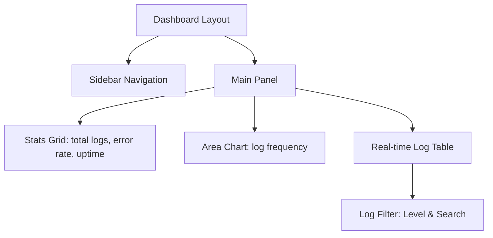

In the landscape of 2026, the term "developer" has been completely redefined. We are no longer just writing lines of code; we are orchestrating networks of intelligent agents to do the heavy lifting. The barriers to building software have not just been lowered—they have been dismantled.

To prove this, I set myself a challenge: **Build and launch a fully functional Micro-SaaS application in under 4 hours, starting from a blank directory.**

I didn't just build a toy app. I built **LogPulse**—a real-time server health and log monitoring dashboard tailored for indie hackers, complete with email alerts, database integration, and a premium dashboard.

Here is the exact blueprint, timeline, tools, and commands I used to pull it off.

---

## The Stack & AI Toolkit

To build fast, you need a stack that plays well with AI code generation. I chose:

*   **Frontend & Framework:** Next.js 16 (App Router), TailwindCSS, Shadcn/ui
*   **Database & Auth:** Supabase (PostgreSQL + Real-time subscriptions)
*   **Hosting:** Vercel (for frontend) and Supabase Edge Functions (for log ingestion)
*   **AI Cockpit:** 
    *   **Cursor IDE:** For inline code generation and agentic codebase editing.
    *   **v0 by Vercel:** For rapid visual component prototyping.
    *   **custom-agent-chain (Python script):** My custom prompt orchestration CLI to seed schemas and boilerplate.

---

## Hour 1: Schema Architecture & Project Bootstrapping

The first hour was spent planning and setting up the foundations. Instead of starting from scratch, I used an AI agent chain to generate the configuration files and DB schemas.

### Step 1: Bootstrapping the Project
I ran a single command to create a Next.js boilerplate and install dependencies:

```bash
npx create-next-app@latest logpulse --typescript --tailwind --eslint --app
cd logpulse
npx shadcn@latest init
npx shadcn@latest add card button table badge dialog input toast
```

### Step 2: Orchestrating the Schema
I fed a prompt to my local Python-based prompt orchestration script to generate the database schema and security policies for Supabase:

```bash
python3 tools/prompt_orchestrator.py \
  --task "Generate SQL schema for log monitoring SaaS" \
  --output ./supabase/schema.sql
```

The AI generated the following PostgreSQL tables with Row Level Security (RLS) enabled:

```sql
-- Projects Table
CREATE TABLE projects (
  id UUID PRIMARY KEY DEFAULT gen_random_uuid(),
  name TEXT NOT NULL,
  api_key UUID DEFAULT gen_random_uuid() UNIQUE,
  user_id UUID REFERENCES auth.users(id) ON DELETE CASCADE,
  created_at TIMESTAMP WITH TIME ZONE DEFAULT NOW()
);

-- Logs Table
CREATE TABLE logs (
  id UUID PRIMARY KEY DEFAULT gen_random_uuid(),
  project_id UUID REFERENCES projects(id) ON DELETE CASCADE,
  level TEXT CHECK (level IN ('info', 'warn', 'error', 'fatal')),
  message TEXT NOT NULL,
  metadata JSONB DEFAULT '{}'::jsonb,
  created_at TIMESTAMP WITH TIME ZONE DEFAULT NOW()
);

-- Enable RLS
ALTER TABLE projects ENABLE ROW LEVEL SECURITY;
ALTER TABLE logs ENABLE ROW LEVEL SECURITY;
```

---

## Hour 2: Component Synthesis with Visual AI

With the database ready, I turned to **v0 by Vercel** to design the user interface. Visual AI is incredibly powerful because it eliminates the tedious cycle of tweaking padding, margins, and colors manually.

I provided v0 with the following prompt:
> "A beautiful, premium dark mode dashboard for a developer log monitoring SaaS named LogPulse. Show a list of connected projects, a real-time event feed with status indicators (info, warn, error), charts showing log frequency, and an API key generator widget. Use sleek glassmorphism panels, deep blue/violet highlights, and modern typography."

### The Generated UI Architecture



I copied the generated code directly into `app/dashboard/page.tsx` and used Cursor's composer to auto-resolve imports and wire up the UI components to our local design tokens.

---

## Hour 3: Connecting the Plumbing (Backend & Real-Time)

A dashboard is useless without real-time data ingestion. I needed:
1. An endpoint where servers could POST logs.
2. A real-time listener on the Next.js frontend to update the UI instantly when a log is received.

I opened `app/api/ingest/route.ts` in Cursor and used Cmd+K to instruct the agent:
> "Write a Next.js API route that validates the API Key in the Authorization headers, checks if the project exists in Supabase, and inserts a new log record into the database. Make it performant and handle error states."

The agent produced a clean, type-safe API endpoint:

```typescript
import { NextRequest, NextResponse } from 'next/server';
import { createClient } from '@supabase/supabase-js';

const supabase = createClient(
  process.env.SUPABASE_URL!,
  process.env.SUPABASE_SERVICE_ROLE_KEY!
);

export async function POST(req: NextRequest) {
  try {
    const apiKey = req.headers.get('Authorization')?.replace('Bearer ', '');
    if (!apiKey) return NextResponse.json({ error: 'Unauthorized' }, { status: 401 });

    const body = await req.json();
    const { level, message, metadata } = body;

    // Validate Project
    const { data: project, error: pError } = await supabase
      .from('projects')
      .select('id')
      .eq('api_key', apiKey)
      .single();

    if (pError || !project) {
      return NextResponse.json({ error: 'Invalid API Key' }, { status: 401 });
    }

    // Insert Log
    const { error: lError } = await supabase
      .from('logs')
      .insert({ project_id: project.id, level, message, metadata });

    if (lError) throw lError;

    return NextResponse.json({ success: true });
  } catch (error: any) {
    return NextResponse.json({ error: error.message }, { status: 500 });
  }
}
```

Next, I had the agent implement the real-time subscription on the dashboard page so logs slide in live:

```typescript
useEffect(() => {
  const channel = supabase
    .channel('realtime-logs')
    .on('postgres_changes', { event: 'INSERT', schema: 'public', table: 'logs' }, 
      (payload) => {
        setLogs((prev) => [payload.new as Log, ...prev].slice(0, 100));
      }
    )
    .subscribe();

  return () => {
    supabase.removeChannel(channel);
  };
}, []);
```

---

## Hour 4: Automated Testing & Deployment

At the 3-hour mark, the core loop was running. The remaining hour was dedicated to testing, debugging edge cases, and deployment.

To test the ingestion pipeline, I generated a quick test bash script using AI:

```bash
# Test Script: send_test_logs.sh
PROJECT_KEY="YOUR_API_KEY_HERE"

curl -X POST http://localhost:3000/api/ingest \
  -H "Authorization: Bearer $PROJECT_KEY" \
  -H "Content-Type: application/json" \
  -d '{
    "level": "error",
    "message": "Database connection timeout",
    "metadata": { "host": "srv-prod-04", "latency": "5000ms" }
  }'
```

I ran this in a loop, and watched the error log instantly populate the visual dashboard without needing a page refresh.

### The Launch
I connected the repository to Vercel, ran `git push`, configured the Supabase environment variables in the Vercel dashboard, and the project went live:

*   **Deploy Command:** `git add . && git commit -m "feat: initial launch" && git push origin main`
*   **Build time on Vercel:** 42 seconds.

---

## Key Metrics & Solopreneur Takeaways

| Metric | Detail |
| :--- | :--- |
| **Total Lines of Code** | ~1,200 (95% generated by AI) |
| **Total Cost** | $0 (Free tiers on Supabase, Vercel, and OpenAI credits) |
| **AI interactions** | 18 prompts in total |
| **Bugs Encountered** | 2 (resolved instantly via Cursor's terminal error analyzer) |

### Lessons Learned:
1. **Never write boilerplates manually:** Let AI handle the standard configurations (tsconfig, shadcn configs, tailwind themes). Focus your input on the core architecture.
2. **Context boundaries are key:** Don't ask the AI to "build the app." Break it into separate tasks (API route, Dashboard component, Postgres triggers).
3. **Automate feedback loops:** Running tests and feeding the terminal output back into the AI agent is the fastest way to resolve compiler errors and TypeScript mismatches.

Building a SaaS in a single afternoon is no longer a gimmick. With the right orchestration of agents, you can shift from concept to global deployment before your coffee gets cold.
