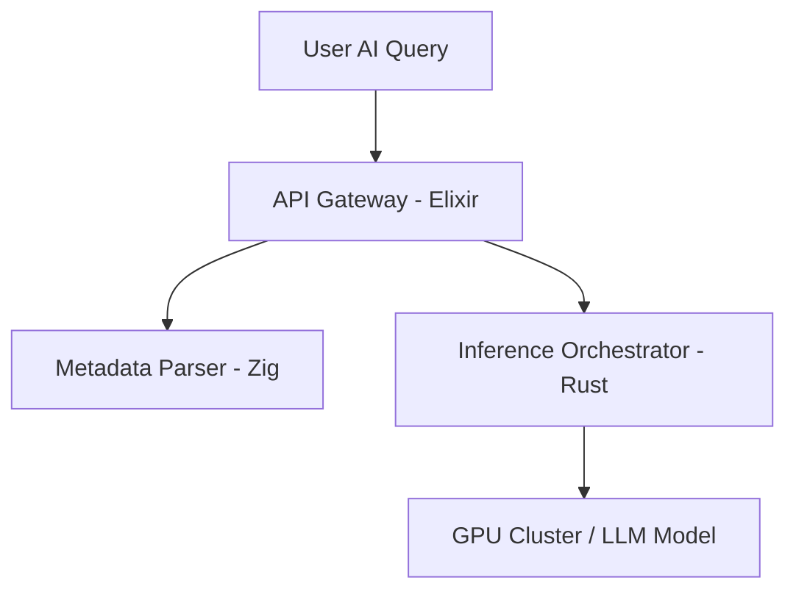

If you browse tech forums or developer job boards in 2026, you will notice a fascinating trend. Python is everywhere. It is the undisputed king of machine learning, AI model training, and data science. But when you look at the **highest-paying software engineering roles**—specifically those commanding base salaries of **$180,000 to $250,000+**—Python is rarely the primary requirement.

Instead, the modern high-salary landscape belongs to three specialized, infrastructure-focused systems and concurrent languages: **Rust**, **Zig**, and **Elixir**.

As AI workloads scale, companies are facing astronomical cloud compute bills. In 2026, engineering efficiency is no longer a luxury; it is a financial necessity. Here is why specialized languages are paying premium salaries, and which one you should learn to maximize your income.

---

## The AI Cloud Bill Crisis

During the initial AI boom, companies rushed to build wrappers and integrations using Python. However, Python's runtime overhead and global interpreter lock (GIL) make it highly inefficient for running massive concurrent backend servers or handling high-throughput data streams.

When a company scales an AI feature to millions of users, the backend infrastructure has to route queries, manage database states, keep WebSockets open, and parse gigabytes of telemetry logs. Doing this in Python requires spinning up hundreds of expensive server instances.

By rewriting core infrastructure in systems-level languages, companies are slashing their server bills by **70% to 90%**. The engineers capable of executing these migrations are being paid premium salaries.



---

## 1. Rust: The Infrastructure Standard ($190,000+ Median)

Rust has officially graduated from a "cool developer tool" to the default choice for critical infrastructure. In 2026, companies like Cloudflare, Microsoft, and AWS are rewriting core components in Rust to eliminate memory safety vulnerabilities and minimize latency.

### Why it pays so well:
*   **Zero-Cost Abstractions:** Rust provides C-like performance without the risk of segmentation faults or buffer overflows.
*   **WebAssembly (WASM):** Running Rust in the browser or in serverless edge runtimes has become the industry standard.
*   **AI Tooling Integration:** High-performance libraries like Hugging Face's tokenizers or key database vectors are written in Rust for speed.

#### Code Snippet: Safe Concurrency in Rust
Unlike Python, Rust enforces strict safety rules at compile time, preventing race conditions before they ever run:

```rust
use std::thread;

fn main() {
    let mut handles = vec![];
    let data = vec![1, 2, 3];

    for i in 0..3 {
        // Move ownership of data securely into thread context
        let data_ref = data.clone();
        let handle = thread::spawn(move || {
            println!("Thread {} processing item: {}", i, data_ref[i]);
        });
        handles.push(handle);
    }

    for handle in handles {
        handle.join().unwrap();
    }
}
```

---

## 2. Zig: The Modern C Successor ($185,000+ Median)

Zig is experiencing a massive surge in demand in 2026. Designed as a robust replacement for C, it simplifies systems programming while offering absolute control over memory allocation.

### Why it pays so well:
*   **No Hidden Control Flow:** Everything in Zig is explicit. There are no operator overloads, macros, or hidden garbage collection.
*   **Interop with C:** Zig can compile C code out of the box, making it the ultimate tool for upgrading legacy systems.
*   **Modern Tooling:** High-profile startups and frameworks (like the JavaScript runtime *Bun*) use Zig to gain speed advantages over Node.js.

```zig
const std = @import("std");

pub fn main() !void {
    const stdout = std.io.getStdOut().writer();
    
    // Explicit memory allocation - no hidden heap allocations
    var gpa = std.heap.GeneralPurposeAllocator(.{}){};
    defer _ = gpa.deinit();
    const allocator = gpa.allocator();

    const list = try allocator.alloc(u32, 10);
    defer allocator.free(list);

    for (list, 0..) |*item, i| {
        item.* = @intCast(i * 10);
    }

    try stdout.print("Zig Array Element 5: {d}\n", .{list[5]});
}
```

---

## 3. Elixir: The Concurrency Powerhouse ($180,000+ Median)

While Rust and Zig target low-level systems programming, Elixir excels at building highly distributed, fault-tolerant web applications. Running on the BEAM virtual machine (originally designed by Ericsson for telecom networks), Elixir can easily manage millions of simultaneous connections on a single server.

### Why it pays so well:
*   **Real-time AI Routing:** AI applications depend heavily on real-time bidirectional communication (WebSockets, SSE). Elixir’s Phoenix LiveView framework makes this incredibly lightweight.
*   **Decentralized Agents:** Elixir's actor model allows developers to model AI agents as individual, isolated virtual processes that can crash and restart without bringing down the server.

---

## Language Comparison: The 2026 Landscape

| Language | Primary Focus | Median Salary (US) | Job Market Demand | Learning Curve |
| :--- | :--- | :--- | :--- | :--- |
| **Rust** | System Safety & WASM | **$195,000** | High | Very High (Borrow Checker) |
| **Zig** | Systems & C Migration | **$185,000** | Medium-High | Medium |
| **Elixir** | Real-time Concurrency | **$182,000** | Medium | Medium-Low (Functional) |
| **Python** | Machine Learning & Data | **$145,000** | Extremely High | Low |

---

## Career Advice for 2026

If you want to cross the $180K threshold, your goal should not be to learn *just another syntax*. You need to master **infrastructure paradigms**. 

1.  **If you enjoy web engineering:** Master **Elixir** and Phoenix. Modern AI networks need real-time data pipelines and reliable WebSocket streaming.
2.  **If you enjoy compilers and system design:** Learn **Rust**. Rust is the backbone of the next generation of databases, operating systems, and AI compilation backends.
3.  **If you want to build high-performance runtimes:** Learn **Zig**. It gives you the execution speed of C with the developer ergonomics of a modern language.

Python will remain the starting point for AI ideas. But if you want to be the engineer who builds the infrastructure that keeps those AI apps running at scale, it is time to expand your language toolkit.
