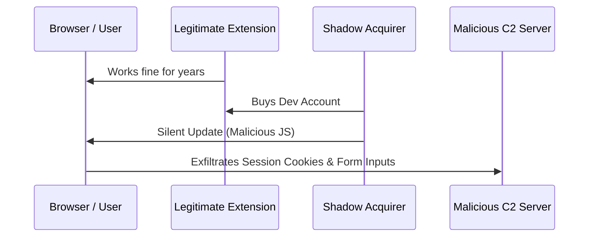

Google Chrome extensions are the Swiss Army knives of the web. They block annoying ads, pick colors for designer projects, parse PDFs, and find discount codes instantly.

But behind the convenience lies a massive, highly lucrative shadow market. In 2026, security researchers have detected a record surge in "extension hijacking"—a practice where malicious data brokers buy popular, legitimate extensions from indie developers and silently push malicious updates that turn those extensions into spyware.

Because extensions run inside your browser, they have direct access to your session tokens, clipboard, and personal messages. 

Here are the **7 most common types of extensions** that security audits have recently caught stealing data, how their attack vectors work, and the exact steps to audit your browser.

---

## How the "Extension Buyout" Trap Works

Before listing the extensions, it is critical to understand *how* safe extensions turn malicious overnight.

1.  **The Target:** An indie developer builds a simple, useful utility (e.g., a volume booster with 500,000 installs).
2.  **The Offer:** A shell corporation contacts the developer, offering $20,000 to $50,000 to buy the extension. 
3.  **The Handover:** The developer sells the extension's Chrome Web Store developer account.
4.  **The Payload:** The new owners release an update. Because Chrome updates extensions silently in the background, users have no idea the code has changed. The extension starts scraping sensitive data and sending it to a command-and-control (C2) server.



---

## The 7 Malicious Extension Types Stealing Data

### 1. The "Minimalist PDF Converter"
*   **The Threat:** Steals active session cookies.
*   **How it works:** When you log into banking or workspace sites, the extension intercepts session cookies from the browser storage API and sends them to third-party endpoints. Attackers can use these session cookies to bypass Multi-Factor Authentication (MFA) entirely.

### 2. The "Simple Color Picker"
*   **The Threat:** Form field grabbing and keystroke logging.
*   **How it works:** By injecting a script into every webpage (`document_start`), this utility reads keydown events inside password and credit card input fields, exfiltrating credentials before they are encrypted.

### 3. The "Alt-Brand Ad Blocker"
*   **The Threat:** Ad hijacking and affiliate link injection.
*   **How it works:** It replaces search engine results with malicious phishing links and intercepts shopping transactions, injecting its own affiliate tags to steal referral payouts and track your shopping habits.

### 4. The "Custom Cursor & Tab Styler"
*   **The Threat:** Stealing active API tokens and browser history.
*   **How it works:** It logs every URL you visit and scans request headers for authorization tokens (like Bearer tokens or JWTs), allowing attackers to compromise connected cloud infrastructure.

### 5. The "Video Downloader Helper"
*   **The Threat:** Malicious redirects and browser search hijacking.
*   **How it works:** It overrides your browser's default search settings. Searches are redirected through middleman proxy domains that inject ads and track user telemetry data.

### 6. The "Volume Booster"
*   **The Threat:** Background socket listening and device profiling.
*   **How it works:** It uses background service workers to download encrypted payloads from external servers, bypassing static checks on the Chrome Web Store. It profiles your system configuration, local IP address, and browser fingerprint.

### 7. The "Auto-Coupon / Price Finder"
*   **The Threat:** Clipboard sniffing.
*   **How it works:** It constantly monitors your system clipboard. When it detects patterns resembling cryptocurrency private keys, seed phrases, or password strings, it immediately transmits them to the attacker's server.

---

## The Permission Audit: Red Flags to Look For

To protect yourself, go to `chrome://extensions` and audit the permissions of every active extension. Here are the red flags:

| Permission | Real Danger | Legitimate Use Case |
| :--- | :--- | :--- |
| **"Read and change all your data on the websites you visit"** | Can read passwords, cookies, and tokens on any website. | Ad blockers, password managers. |
| **"Read and modify data you copy and paste"** | Can read clipboard items (credentials, seed phrases). | Clipboard managers, translation tools. |
| **"Manage your apps, extensions, and themes"** | Can disable security extensions or install hidden ones. | Developer utility suites. |

---

## 3 Steps to Secure Your Browser Right Now

### Step 1: Force manifest V3 verification
Google is gradually deprecating Manifest V2 extensions in favor of **Manifest V3**, which restricts extensions from executing remotely hosted code. Check if your extensions are still running on V2 and remove them:

```javascript
// Paste this in Chrome's Developer Console on chrome://extensions to list V2 extensions
chrome.developerPrivate.getExtensionsInfo((info) => {
  const v2Extensions = info.filter(ext => ext.manifestVersion === 2);
  console.log("V2 Extensions to remove:", v2Extensions.map(e => e.name));
});
```

### Step 2: Restrict Site Access
Never give an extension access to "all sites" if it only needs to work on one. Right-click the extension icon, choose **This Can Read and Change Site Data**, and change it from *On all sites* to *On click* or *On specific sites*.

### Step 3: Enable Chrome's Enhanced Protection
Go to `chrome://settings/security` and toggle on **Enhanced Protection**. This enables real-time scanning of extensions and files, warning you immediately if an extension is flagged as malicious by Google's threat analysis engine.

Browser extensions are a vector of trust. Treat them like software you install on your system—keep the list minimal, audit them regularly, and remove anything you haven't used in the past 30 days.
